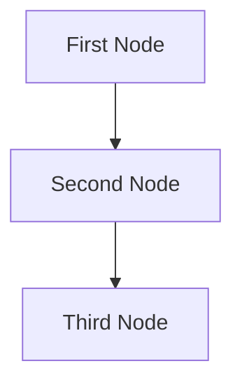

# Design Doc: Your Project Name

> Please DON'T remove notes for AI

## Requirements

> Notes for AI: Keep it simple and clear.
> If the requirements are abstract, write concrete user stories

## Flow Design

> Notes for AI:
>
> 1. Consider the design patterns of agent, map-reduce, rag, and workflow. Apply them if they fit.
> 2. Present a concise, high-level description of the workflow.

### Applicable Design Pattern:

1. Map the file summary into chunks, then reduce these chunks into a final summary.
2. Agentic file finder
   - _Context_: The entire summary of the file
   - _Action_: Find the file

### Flow high-level Design:

1. **First Node**: This node is for ...
2. **Second Node**: This node is for ...
3. **Third Node**: This node is for ...



## Utility Functions

> Notes for AI:
>
> 1. Understand the utility function definition thoroughly by reviewing the doc.
> 2. Include only the necessary utility functions, based on nodes in the flow.

1. **Call LLM** (`utils/llm.ts`)

   - _Input_: prompt (string)
   - _Output_: response (string)
   - Generally used by most nodes for LLM tasks

2. **Embedding** (`utils/get-embedding.ts`)
   - _Input_: string
   - _Output_: a vector of 3072 floats
   - Used by the second node to embed text

## Node Design

### Shared Memory

> Notes for AI: Try to minimize data redundancy

The shared memory structure is organized as follows:

```python
shared = {
    "key": "value"
}
```

### Node Steps

> Notes for AI: Carefully decide whether to use Batch/Async Node/Flow.

1. First Node

- _Purpose_: Provide a short explanation of the node’s function
- _Type_: Decide between Regular, Batch, or Async
- _Steps_:
  - _prep_: Read "key" from the shared store
  - _exec_: Call the utility function
  - _post_: Write "key" to the shared store

2. Second Node
   ...
