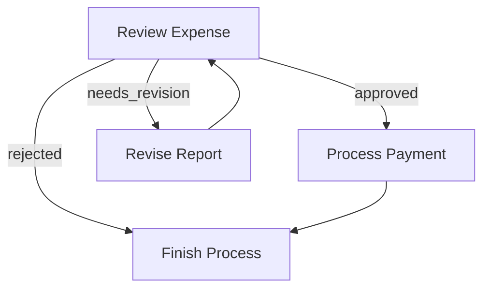
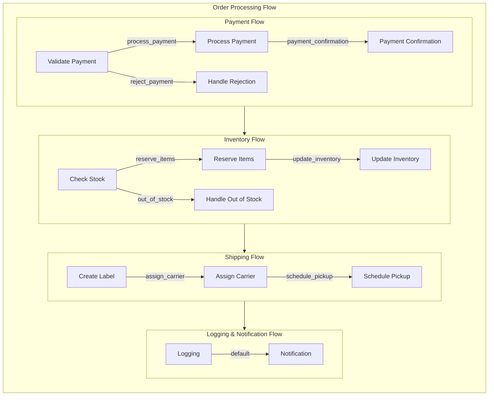
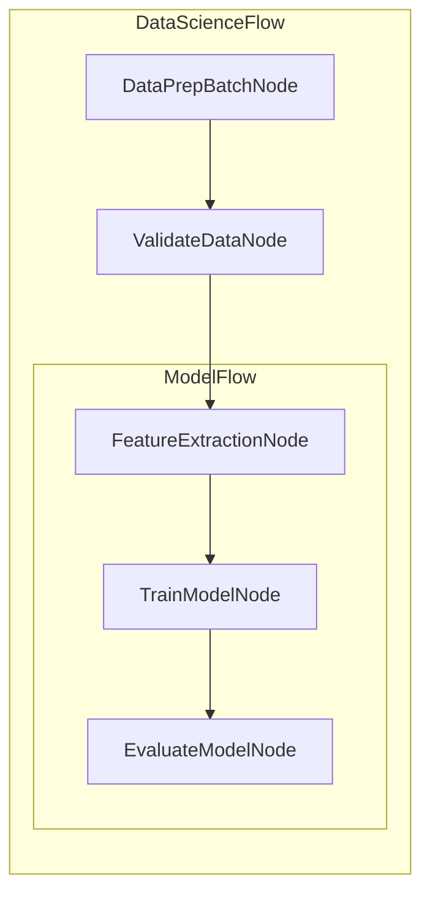

# Agent

For many tasks, we need agents that take dynamic and recursive actions based on the inputs they receive.
You can create these agents as **Nodes** connected by _Actions_ in a directed graph using [Flow](./flow.md).

### Example: Search Agent

This agent:

1. Decides whether to search or answer.
2. If it decides to search, loops back to decide if more searches are needed.
3. Finally answers once enough context has been gathered.

````typescript
import { BaseNode, Flow, DEFAULT_ACTION } from "pocketflowframework";

// Placeholder for an LLM call
async function callLLM(prompt: string): Promise<string> {
  // Example function to call a Large Language Model
  // Return a YAML-like string (or any structured string) in practice
  return `
\`\`\`yaml
action: "search"
reason: "Need more results"
search_term: "Nobel Prize 2024"
\`\`\`
`;
}

// Placeholder for a web search
async function searchWeb(searchTerm: string): Promise<string> {
  // Example function that interacts with an external API
  return `Search Results for: ${searchTerm}`;
}

export class DecideAction extends BaseNode {
  // The 'prep' method extracts data from sharedState to pass into execCore
  public async prep(sharedState: any): Promise<[string, string]> {
    const context = sharedState.context ?? "No previous search";
    const query = sharedState.query;
    return [query, context];
  }

  // The main logic calls callLLM to decide whether to search again or to answer
  public async execCore(inputs: [string, string]): Promise<any> {
    const [query, context] = inputs;
    const prompt = `
Given input: ${query}
Previous search results: ${context}
Should I: 1) Search web for more info 2) Answer with current knowledge
Output in YAML:
\`\`\`yaml
action: search/answer
reason: Explanation
search_term: search phrase if action is search
\`\`\`
    `;

    const resp = await callLLM(prompt);

    // Parse YAML from resp (this is example logic; you'd use a real YAML parser)
    const yamlStr = resp.split("```yaml")[1]?.split("```")[0]?.trim() || "";
    // Assume the structure is { action, reason, search_term? }
    const parsed = {
      action: "search",
      reason: "Need more results",
      search_term: "Nobel Prize 2024",
    };
    // In a real scenario, you'd do something like:
    // const parsed = yaml.load(yamlStr); // using js-yaml or similar

    if (parsed.action === "search" && !parsed.search_term) {
      throw new Error("Missing search_term for 'search' action!");
    }

    return parsed;
  }

  public async post(
    prepResult: [string, string],
    execResult: any,
    sharedState: any
  ): Promise<string> {
    if (execResult.action === "search") {
      sharedState.search_term = execResult.search_term;
    }
    return execResult.action;
  }
}

export class SearchWebNode extends BaseNode {
  public async prep(sharedState: any): Promise<string> {
    return sharedState.search_term;
  }

  public async execCore(searchTerm: string): Promise<string> {
    return await searchWeb(searchTerm);
  }

  public async post(
    prepResult: string,
    execResult: string,
    sharedState: any
  ): Promise<string> {
    const previous = sharedState.context || [];
    sharedState.context = [
      ...previous,
      { term: prepResult, result: execResult },
    ];

    // Loop back to the DecideAction node
    return "decide";
  }
}

export class DirectAnswer extends BaseNode {
  public async prep(sharedState: any): Promise<[string, any]> {
    return [sharedState.query, sharedState.context ?? ""];
  }

  public async execCore(inputs: [string, any]): Promise<string> {
    const [query, context] = inputs;
    const prompt = `Context: ${JSON.stringify(
      context
    )}\nAnswer this query: ${query}`;
    return await callLLM(prompt);
  }

  public async post(
    prepResult: [string, any],
    execResult: string,
    sharedState: any
  ): Promise<string> {
    console.log("Answer:", execResult);
    sharedState.answer = execResult;
    return DEFAULT_ACTION; // or any string that indicates the flow is done
  }
}

// Connect nodes
const decide = new DecideAction();
const search = new SearchWebNode();
const answer = new DirectAnswer();

decide.addSuccessor(search, "search");
decide.addSuccessor(answer, "answer");
search.addSuccessor(decide, "decide"); // loop back

const flow = new Flow(decide);
flow.run({ query: "Who won the Nobel Prize in Physics 2024?" });
````

In this TypeScript example:

- **DecideAction** checks the shared state, queries an LLM, and sets the next action to either “search” or “answer.”
- **SearchWebNode** performs a web search and appends the result to `sharedState.context`, then loops back to the decision node.
- **DirectAnswer** produces a final answer when enough context has been gathered.

**Notes:**

- **YAML Parsing:** In the `execCore` method of `DecideAction`, replace the placeholder parsing logic with a proper YAML parser like [`js-yaml`](https://github.com/nodeca/js-yaml) to handle the YAML response from `callLLM`.

  ```typescript
  import yaml from "js-yaml";

  // Inside execCore
  const parsed = yaml.load(yamlStr) as {
    action: string;
    reason: string;
    search_term?: string;
  };
  ```

- **LLM and Search Implementations:** Ensure that the `callLLM` and `searchWeb` functions are properly implemented to interact with your chosen LLM service and web search API, respectively.

- **Error Handling:** Enhance error handling as needed, especially around the parsing and execution steps to make your agents more robust.

Feel free to adjust the code to fit your actual implementations and expand upon the agent’s capabilities as required!---
layout: default
title: "Sample Applications"
nav_order: 5

---

# Sample Applications

Here are some example applications built with the Pocket Flow Framework to demonstrate its capabilities.

## 1. Document Processing Pipeline

A flow that processes documents through multiple stages:

```typescript
import { BaseNode, Flow, DEFAULT_ACTION } from "pocketflowframework";

class DocumentLoaderNode extends BaseNode {
  async prep(sharedState: any) {
    return sharedState.documentPath;
  }

  async execCore(path: string) {
    // Simulate loading document
    return { content: "Sample document content" };
  }

  async post(prepResult: any, execResult: any, sharedState: any) {
    sharedState.document = execResult;
    return DEFAULT_ACTION;
  }
}

class TextExtractorNode extends BaseNode {
  async prep(sharedState: any) {
    return sharedState.document;
  }

  async execCore(document: any) {
    return document.content.toLowerCase();
  }

  async post(prepResult: any, execResult: any, sharedState: any) {
    sharedState.extractedText = execResult;
    return DEFAULT_ACTION;
  }
}

// Create and connect nodes
const loader = new DocumentLoaderNode();
const extractor = new TextExtractorNode();
loader.addSuccessor(extractor);

// Create flow
const docFlow = new Flow(loader);

// Run the flow
await docFlow.run({
  documentPath: "path/to/document.pdf",
});
```

## 2. Data Processing with Retry Logic

An example showing retry capabilities for API calls:

```typescript
class ApiNode extends RetryNode {
  constructor() {
    super(3, 1000); // 3 retries, 1 second interval
  }

  async prep(sharedState: any) {
    return sharedState.apiEndpoint;
  }

  async execCore(endpoint: string) {
    // Simulate API call that might fail
    const response = await fetch(endpoint);
    if (!response.ok) throw new Error("API call failed");
    return response.json();
  }

  async post(prepResult: any, execResult: any, sharedState: any) {
    sharedState.apiResponse = execResult;
    return DEFAULT_ACTION;
  }
}
```

## 3. Parallel Processing with BatchFlow

Example of processing multiple items in parallel:

```typescript
class ImageProcessingFlow extends BatchFlow {
  async prep(sharedState: any) {
    // Return array of image paths to process
    return sharedState.imagePaths;
  }

  async post(prepResults: string[], results: any[], sharedState: any) {
    sharedState.processedImages = results;
    return DEFAULT_ACTION;
  }
}

// Usage
const batchFlow = new ImageProcessingFlow(processingNode);
await batchFlow.run({
  imagePaths: ["image1.jpg", "image2.jpg", "image3.jpg"],
});
```

## 4. Conditional Branching Flow

Example of a flow with different paths based on conditions:

```typescript
class ValidationNode extends BaseNode {
  async prep(sharedState: any) {
    return sharedState.data;
  }

  async execCore(data: any) {
    return data.isValid;
  }

  async post(prepResult: any, execResult: any, sharedState: any) {
    return execResult ? "valid" : "invalid";
  }
}

// Create nodes
const validator = new ValidationNode();
const successHandler = new SuccessNode();
const errorHandler = new ErrorNode();

// Set up branching
validator.addSuccessor(successHandler, "valid");
validator.addSuccessor(errorHandler, "invalid");

// Create and run flow
const flow = new Flow(validator);
await flow.run({
  data: { isValid: true },
});
```

## 5. Nested Flows Example

Demonstrating how to compose complex workflows:

```typescript
// Sub-flow for data preprocessing
const preprocessFlow = new Flow(preprocessNode);
preprocessFlow.addSuccessor(validationNode);

// Sub-flow for model inference
const inferenceFlow = new Flow(modelNode);
inferenceFlow.addSuccessor(postprocessNode);

// Main flow combining sub-flows
preprocessFlow.addSuccessor(inferenceFlow);
const mainFlow = new Flow(preprocessFlow);

// Run the composed flow
await mainFlow.run({
  input: "Raw data",
});
```

These examples demonstrate key features of the framework:

- Basic node implementation
- Retry logic for robust operations
- Parallel processing with BatchFlow
- Conditional branching
- Flow composition

Each example can be extended and customized based on specific requirements.---
layout: default
title: "(Advanced) Async"
parent: "Core Abstraction"
nav_order: 5

---

# (Advanced) Async

**Async** Nodes implement `prep_async()`, `exec_async()`, `exec_fallback_async()`, and/or `post_async()`. This is useful for:

1. **prep_async()**

   - For _fetching/reading data (files, APIs, DB)_ in an I/O-friendly way.

2. **exec_async()**

   - Typically used for async LLM calls.

3. **post_async()**
   - For _awaiting user feedback_, _coordinating across multi-agents_ or any additional async steps after `exec_async()`.

**Note**: `AsyncNode` must be wrapped in `AsyncFlow`. `AsyncFlow` can also include regular (sync) nodes.

### Example

````python
class SummarizeThenVerify(AsyncNode):
    async def prep_async(self, shared):
        # Example: read a file asynchronously
        doc_text = await read_file_async(shared["doc_path"])
        return doc_text

    async def exec_async(self, prep_res):
        # Example: async LLM call
        summary = await call_llm_async(f"Summarize: {prep_res}")
        return summary

    async def post_async(self, shared, prep_res, exec_res):
        # Example: wait for user feedback
        decision = await gather_user_feedback(exec_res)
        if decision == "approve":
            shared["summary"] = exec_res
            return "approve"
        return "deny"

summarize_node = SummarizeThenVerify()
final_node = Finalize()

# Define transitions
summarize_node - "approve" >> final_node
summarize_node - "deny"    >> summarize_node  # retry

flow = AsyncFlow(start=summarize_node)

async def main():
    shared = {"doc_path": "document.txt"}
    await flow.run_async(shared)
    print("Final Summary:", shared.get("summary"))

asyncio.run(main())
```---
layout: default
title: "Batch"
parent: "Core Abstraction"
nav_order: 4
---

# Batch

**Batch** makes it easier to handle large inputs in one Node or **rerun** a Flow multiple times. Handy for:
- **Chunk-based** processing (e.g., splitting large texts)
- **Multi-file** processing
- **Iterating** over lists of params (e.g., user queries, documents, URLs)

## 1. BatchNode

A **BatchNode** extends `BaseNode` but changes how we handle execution:

```typescript
import { BaseNode, Flow, DEFAULT_ACTION } from "pocketflowframework";

class MapSummaries extends BaseNode {
    // The 'prep' method returns chunks to process
    public async prep(sharedState: any): Promise<string[]> {
        const content = sharedState.data["large_text.txt"] || "";
        const chunkSize = 10000;
        const chunks = [];
        for (let i = 0; i < content.length; i += chunkSize) {
            chunks.push(content.substring(i, i + chunkSize));
        }
        return chunks;
    }

    // The 'execCore' method processes each chunk
    public async execCore(chunk: string): Promise<string> {
        const prompt = `Summarize this chunk in 10 words: ${chunk}`;
        return await callLLM(prompt);
    }

    // The 'post' method combines all summaries
    public async post(prepResult: string[], execResult: string, sharedState: any): Promise<string> {
        sharedState.summary["large_text.txt"] = execResult;
        return DEFAULT_ACTION;
    }
}

// Create and run the flow
const mapSummaries = new MapSummaries();
const flow = new Flow(mapSummaries);

await flow.run({
    data: {
        "large_text.txt": "Your very large text content goes here..."
    },
    summary: {}
});
````

## 2. BatchFlow

A **BatchFlow** runs a **Flow** multiple times with different parameters. Think of it as a loop that replays the Flow for each parameter set.

```typescript
import { BaseNode, BatchFlow, Flow, DEFAULT_ACTION } from "pocketflowframework";

// Define nodes for processing a single file
class LoadFile extends BaseNode {
  public async prep(sharedState: any): Promise<string> {
    return sharedState.filename;
  }

  public async execCore(filename: string): Promise<string> {
    return await readFile(filename);
  }

  public async post(
    prepResult: string,
    execResult: string,
    sharedState: any
  ): Promise<string> {
    sharedState.currentContent = execResult;
    return "summarize";
  }
}

class SummarizeFile extends BaseNode {
  public async prep(sharedState: any): Promise<string> {
    return sharedState.currentContent;
  }

  public async execCore(content: string): Promise<string> {
    return await callLLM(`Summarize: ${content}`);
  }

  public async post(
    prepResult: string,
    execResult: string,
    sharedState: any
  ): Promise<string> {
    sharedState.summaries[sharedState.filename] = execResult;
    return DEFAULT_ACTION;
  }
}

// Build the per-file flow
const loadFileNode = new LoadFile();
const summarizeFileNode = new SummarizeFile();

loadFileNode.addSuccessor(summarizeFileNode, "summarize");
const fileFlow = new Flow(loadFileNode);

// Define the BatchFlow that iterates over files
class SummarizeAllFiles extends BatchFlow {
  public async prep(sharedState: any): Promise<{ filename: string }[]> {
    const filenames = Object.keys(sharedState.data);
    return filenames.map((fn) => ({ filename: fn }));
  }

  public async post(
    prepResults: any[],
    results: any[],
    sharedState: any
  ): Promise<string> {
    console.log("All files summarized");
    return DEFAULT_ACTION;
  }
}

// Run the BatchFlow
const summarizeAllFiles = new SummarizeAllFiles();
await summarizeAllFiles.run({
  data: {
    "file1.txt": "Content of file 1...",
    "file2.txt": "Content of file 2...",
  },
  summaries: {},
});
```

## 3. Example: Building an Agent with Pocket Flow

Here's how to use ChatGPT/Claude to help build an agent using Pocket Flow. Copy these prompts:

```
I want to build an agent that can:
1. Take a complex task
2. Break it into subtasks
3. Execute each subtask
4. Combine the results

Using this TypeScript framework:

[paste the pocket.ts code here]

Can you help me create:
1. A TaskPlannerNode that uses an LLM to break down tasks
2. A TaskExecutorNode that handles individual subtasks
3. A ResultCombinerNode that synthesizes results
4. A Flow that connects these together
```

Or for a more specific agent:

```
I want to build a research agent that can:
1. Take a research question
2. Search for relevant information
3. Analyze and synthesize findings
4. Generate a summary report

Using this TypeScript framework:

[paste the pocket.ts code here]

Can you help me create:
1. A SearchNode that finds relevant sources
2. An AnalysisNode that extracts key information
3. A SynthesisNode that combines findings
4. A Flow that orchestrates the research process
```

These prompts help you leverage AI to build sophisticated agents while maintaining the structure and type safety of the Pocket Flow framework.

## Summary

- **BatchNode**: Process large inputs in chunks
- **BatchFlow**: Run flows multiple times with different parameters
- Use AI assistants to help build complex agents with the framework

Remember to handle errors appropriately and test your implementations thoroughly.---
layout: default
title: "Communication"
parent: "Core Abstraction"
nav_order: 3

---

# Communication

Nodes and Flows **communicate** in two ways:

1. **Shared Store** – A global data structure (often an in-memory object) that all nodes can read and write. Every Node's `prepAsync()` and `postAsync()` methods receive the **same** `shared` store.
2. **Params** – Each node and Flow has a unique `params` object assigned by the **parent Flow**, typically used as an identifier for tasks. It's strongly recommended to keep parameter keys and values **immutable**.

If you understand memory management, think of the **Shared Store** like a **heap** (shared by all function calls), and **Params** like a **stack** (assigned by the caller).

> **Why not use other communication models like Message Passing?**
>
> At a _low-level_ between nodes, _Message Passing_ works fine for simple DAGs, but in nested or cyclic Flows it becomes unwieldy. A shared store keeps things straightforward.
>
> That said, _high-level_ multi-agent patterns like _Message Passing_ and _Event-Driven Design_ can still be layered on top via _Async Queues or Pub/Sub_ in a shared store (see [Multi-Agents](./multi_agent.md)).
> {: .note }

---

## 1. Shared Store

### Overview

A shared store is typically an in-memory object, like:

```typescript
const shared = {
  data: {},
  summary: {},
  config: {
    /* ... */
  },
};
```

It can also contain local file handlers, database connections, or a combination for persistence. We recommend deciding the data structure or database schema first based on your application's requirements.

### Example

```typescript
import { BaseNode, Flow, DEFAULT_ACTION } from "pocketflowframework";

// Placeholder for an asynchronous LLM call
async function callLLM(prompt: string): Promise<string> {
  // Example implementation
  return "This is a summary generated by the LLM.";
}

export class LoadDataNode extends BaseNode {
  public async prepAsync(sharedState: any): Promise<void> {
    // Simulate reading data from an API or disk
    sharedState.data["my_file.txt"] =
      "Some text content loaded asynchronously.";
  }

  public async execAsync(_: void): Promise<void> {
    // No execution needed for loading data
  }

  public async postAsync(sharedState: any, _: void, __: void): Promise<string> {
    return DEFAULT_ACTION;
  }
}

export class SummarizeNode extends BaseNode {
  public async prepAsync(sharedState: any): Promise<string> {
    // Access data loaded by LoadDataNode
    return sharedState.data["my_file.txt"] || "";
  }

  public async execAsync(content: string): Promise<string> {
    const prompt = `Summarize the following content:\n${content}`;
    return await callLLM(prompt);
  }

  public async postAsync(
    sharedState: any,
    _: string,
    execResult: string
  ): Promise<string> {
    sharedState.summary["my_file.txt"] = execResult;
    return "default";
  }
}

// Instantiate nodes
const loadData = new LoadDataNode();
const summarize = new SummarizeNode();

// Define the flow
loadData.addSuccessor(summarize, "default");
const flow = new Flow(loadData);

// Initial shared state
const shared = { data: {}, summary: {}, config: {} };

// Run the flow
flow
  .runAsync(shared)
  .then(() => {
    console.log("Summary:", shared.summary["my_file.txt"]);
  })
  .catch((error) => {
    console.error("Flow execution failed:", error);
  });
```

**Explanation:**

- **LoadDataNode**:

  - **prepAsync()**: Asynchronously loads data into the `sharedState.data` object.
  - **execAsync()**: No operation needed; data loading is handled in `prepAsync()`.
  - **postAsync()**: Transitions to the next node by returning `DEFAULT_ACTION`.

- **SummarizeNode**:

  - **prepAsync()**: Retrieves the loaded data from `sharedState`.
  - **execAsync()**: Calls an asynchronous LLM function to summarize the content.
  - **postAsync()**: Stores the summary in `sharedState.summary` and transitions to the next action.

- **Flow Execution**:
  - The flow starts with `LoadDataNode`, which loads data.
  - Upon completion, it transitions to `SummarizeNode` to process and summarize the data.
  - After execution, the summary is available in `shared.summary["my_file.txt"]`.

---

## 2. Params

**Params** allow you to store _per-Node_ or _per-Flow_ configuration that doesn't need to reside in the shared store. They are:

- **Immutable** during a Node's run cycle (i.e., they don't change mid-`prepAsync`, `execAsync`, `postAsync`).
- **Set** via `setParams()`.
- **Cleared** and updated each time a parent Flow calls it.

> Only set the uppermost Flow params because others will be overwritten by the parent Flow. If you need to set child node params, see [Batch](./batch.md).
> {: .warning }

Typically, **Params** are identifiers (e.g., file name, page number). Use them to fetch the task you assigned or write to a specific part of the shared store.

### Example

```typescript
import { BaseNode, Flow, DEFAULT_ACTION } from "pocketflowframework";

// Placeholder for an asynchronous LLM call
async function callLLM(prompt: string): Promise<string> {
  // Example implementation
  return `Summary for ${prompt}`;
}

export class SummarizeFileNode extends BaseNode {
  public async prepAsync(sharedState: any): Promise<string> {
    // Access the node's params
    const filename = this.params["filename"];
    return sharedState.data[filename] || "";
  }

  public async execAsync(content: string): Promise<string> {
    const prompt = `Summarize the following content:\n${content}`;
    return await callLLM(prompt);
  }

  public async postAsync(
    sharedState: any,
    _: string,
    execResult: string
  ): Promise<string> {
    const filename = this.params["filename"];
    sharedState.summary[filename] = execResult;
    return DEFAULT_ACTION;
  }
}

// Instantiate the node
const summarizeFile = new SummarizeFileNode();

// Set Node params directly (for testing)
summarizeFile.setParams({ filename: "doc1.txt" });

// Define the flow
const flow = new Flow(summarizeFile);

// Initial shared state
const shared = { data: { "doc1.txt": "Content of document 1." }, summary: {} };

// Run the flow
flow
  .runAsync(shared)
  .then(() => {
    console.log("Summary:", shared.summary["doc1.txt"]);
  })
  .catch((error) => {
    console.error("Flow execution failed:", error);
  });

// Alternatively, set Flow params (overwrites node params)
const flowWithParams = new Flow(summarizeFile);
flowWithParams.setParams({ filename: "doc2.txt" });
flowWithParams
  .runAsync({ data: { "doc2.txt": "Content of document 2." }, summary: {} })
  .then(() => {
    console.log("Summary:", shared.summary["doc2.txt"]);
  })
  .catch((error) => {
    console.error("Flow execution failed:", error);
  });
```

**Explanation:**

1. **SummarizeFileNode**:

   - **prepAsync()**: Retrieves the filename from `this.params` and fetches the corresponding data from `sharedState`.
   - **execAsync()**: Calls an asynchronous LLM function to summarize the content.
   - **postAsync()**: Stores the summary in `sharedState.summary` using the filename as the key.

2. **Flow Execution**:
   - **Node Params**: Directly setting params on the node (`doc1.txt`) and running the flow.
   - **Flow Params**: Setting params on the flow (`doc2.txt`), which overwrites the node's params, and running the flow.

---

## 3. Shared Store vs. Params

Think of the **Shared Store** like a heap and **Params** like a stack.

- **Shared Store**:

  - **Public, Global**:
    - Accessible by all nodes within the flow.
  - **Pre-populated**:
    - Can be initialized with data before the flow starts.
  - **Use Cases**:
    - Data results, large content, or any information multiple nodes need.
  - **Organization**:
    - Structure it carefully, similar to designing a mini schema for clarity and maintainability.

- **Params**:
  - **Local, Ephemeral**:
    - Specific to each node or flow instance.
  - **Set by Parent Flows**:
    - Assigned by the flow managing the node.
  - **Use Cases**:
    - Small values like filenames, page numbers, or identifiers.
  - **Characteristics**:
    - Immutable during execution.
    - Do not persist across different nodes and are reset with each new flow run.

### Key Differences

| Feature            | Shared Store                       | Params                                |
| ------------------ | ---------------------------------- | ------------------------------------- |
| **Scope**          | Global within the flow             | Local to the node or flow instance    |
| **Mutability**     | Mutable                            | Immutable during execution            |
| **Initialization** | Can be pre-populated               | Set dynamically by parent flows       |
| **Use Cases**      | Large data, results, shared info   | Identifiers, small configuration data |
| **Persistence**    | Can include persistent connections | Temporary and ephemeral               |

---

# Summary

By converting your Python-based communication examples to TypeScript, you can take full advantage of TypeScript's strong typing and modern asynchronous features. The provided examples demonstrate how to implement **Shared Store** and **Params** mechanisms within your `pocket.ts` framework, ensuring efficient and organized inter-node communication.

**Key Points:**

- **Shared Store**:

  - Facilitates global data sharing across nodes.
  - Ideal for storing large datasets, results, and shared configurations.
  - Must be carefully structured to maintain clarity.

- **Params**:
  - Enables passing specific identifiers or configuration data to individual nodes.
  - Ensures immutability during node execution for consistency.
  - Best suited for transient data like filenames or user inputs.

**Next Steps:**

- **Implement Actual Logic**: Replace placeholder functions like `callLLM` with real implementations that interact with your services.
- **Enhance Error Handling**: Incorporate comprehensive error checks and handling within your nodes to manage potential failures gracefully.
- **Optimize Data Structures**: Design and standardize your shared store's data structures to suit various application needs.
- **Expand Documentation**: Continue documenting other core abstractions and features of your framework to maintain consistency and clarity.

Feel free to further customize these examples to fit your project's specific requirements. If you have any questions or need additional assistance, don't hesitate to ask!---
layout: default
title: "Core Abstraction"
nav_order: 2
has_children: true

---

# Core Abstractions

The Pocket Flow Framework is built around three core abstractions: **Nodes**, **Flows**, and **BatchFlows**. These abstractions allow you to define modular, reusable, and scalable workflows.

## 1. Nodes

A **Node** is the fundamental building block of a workflow. It represents a single unit of work and is implemented by extending the [BaseNode](cci:2://file:///Users/helenazhang/Pocket-Flow-Framework/src/pocket.ts:4:0-78:1) class. Nodes have three primary methods:

- **[prep(sharedState)](cci:1://file:///Users/helenazhang/Pocket-Flow-Framework/src/pocket.ts:155:4-158:5)**: Prepares the node for execution by initializing any necessary state or resources.
- **[execCore(prepResult)](cci:1://file:///Users/helenazhang/Pocket-Flow-Framework/src/pocket.ts:122:4-124:5)**: Executes the core logic of the node.
- **[post(prepResult, execResult, sharedState)](cci:1://file:///Users/helenazhang/Pocket-Flow-Framework/src/pocket.ts:65:4-65:86)**: Determines the next action to take based on the execution result.

Nodes can be chained together using **successors**, which define transitions based on the [post](cci:1://file:///Users/helenazhang/Pocket-Flow-Framework/src/pocket.ts:65:4-65:86) method's return value.

## 2. Flows

A **Flow** orchestrates the execution of a sequence of nodes. It starts with a single entry point (the `start` node) and follows transitions defined by the [post](cci:1://file:///Users/helenazhang/Pocket-Flow-Framework/src/pocket.ts:65:4-65:86) method of each node. The [Flow](cci:2://file:///Users/helenazhang/Pocket-Flow-Framework/src/pocket.ts:103:0-152:1) class extends [BaseNode](cci:2://file:///Users/helenazhang/Pocket-Flow-Framework/src/pocket.ts:4:0-78:1) and provides methods for orchestrating the execution of nodes.

## 3. BatchFlows

A **BatchFlow** extends the [Flow](cci:2://file:///Users/helenazhang/Pocket-Flow-Framework/src/pocket.ts:103:0-152:1) class to handle workflows that process multiple items in parallel. It prepares a list of items, orchestrates their execution, and aggregates the results.

## Example: Simple Flow

Here’s an example of creating a simple flow with two nodes:

```typescript
import { BaseNode, Flow, DEFAULT_ACTION } from "pocketflowframework";

class NodeA extends BaseNode {
  async prep(sharedState: any): Promise<void> {}
  async execCore(prepResult: any): Promise<void> {}
  async post(
    prepResult: any,
    execResult: any,
    sharedState: any
  ): Promise<string> {
    return "default";
  }
}

class NodeB extends BaseNode {
  async prep(sharedState: any): Promise<void> {}
  async execCore(prepResult: any): Promise<void> {}
  async post(
    prepResult: any,
    execResult: any,
    sharedState: any
  ): Promise<string> {
    return DEFAULT_ACTION;
  }
}

const nodeA = new NodeA();
const nodeB = new NodeB();
nodeA.addSuccessor(nodeB, "default");

const flow = new Flow(nodeA);
flow.run({});
```

This flow starts with `NodeA` and transitions to `NodeB` when `NodeA.post()` returns `"default"`.---
layout: default
title: "Task Decomposition"
parent: "Paradigm"
nav_order: 2

---

# Task Decomposition

Many real-world tasks are too complex for a single LLM call. The solution is to decompose them into multiple calls as a [Flow](./flow.md) of Nodes.

### Example: Article Writing

This example demonstrates how to break down the task of writing an article into smaller, manageable steps using TypeScript and the `pocket.ts` framework.

```typescript
import { BaseNode, Flow, DEFAULT_ACTION } from "pocketflowframework";

// Placeholder for an asynchronous LLM call
async function callLLM(prompt: string): Promise<string> {
  // Replace with actual implementation, e.g., API call to an LLM service
  return `Generated response based on prompt: ${prompt}`;
}

export class GenerateOutlineNode extends BaseNode {
  // The 'prepAsync' method prepares the topic for generating an outline
  public async prepAsync(sharedState: any): Promise<string> {
    return sharedState.topic;
  }

  // The 'execAsync' method generates a detailed outline for the article
  public async execAsync(topic: string): Promise<string> {
    const prompt = `Create a detailed outline for an article about ${topic}`;
    const outline = await callLLM(prompt);
    return outline;
  }

  // The 'postAsync' method stores the generated outline in the shared store
  public async postAsync(
    sharedState: any,
    _: string,
    execResult: string
  ): Promise<string> {
    sharedState.outline = execResult;
    return DEFAULT_ACTION; // Proceed to the next node
  }
}

export class WriteSectionNode extends BaseNode {
  // The 'prepAsync' method retrieves the outline from the shared store
  public async prepAsync(sharedState: any): Promise<string> {
    return sharedState.outline;
  }

  // The 'execAsync' method writes content based on the outline
  public async execAsync(outline: string): Promise<string> {
    const prompt = `Write content based on this outline: ${outline}`;
    const draft = await callLLM(prompt);
    return draft;
  }

  // The 'postAsync' method stores the draft in the shared store
  public async postAsync(
    sharedState: any,
    _: string,
    execResult: string
  ): Promise<string> {
    sharedState.draft = execResult;
    return DEFAULT_ACTION; // Proceed to the next node
  }
}

export class ReviewAndRefineNode extends BaseNode {
  // The 'prepAsync' method retrieves the draft from the shared store
  public async prepAsync(sharedState: any): Promise<string> {
    return sharedState.draft;
  }

  // The 'execAsync' method reviews and improves the draft
  public async execAsync(draft: string): Promise<string> {
    const prompt = `Review and improve this draft: ${draft}`;
    const finalArticle = await callLLM(prompt);
    return finalArticle;
  }

  // The 'postAsync' method stores the final article in the shared store
  public async postAsync(
    sharedState: any,
    _: string,
    execResult: string
  ): Promise<string> {
    sharedState.final_article = execResult;
    return DEFAULT_ACTION; // Flow is complete
  }
}

// Instantiate nodes
const generateOutline = new GenerateOutlineNode();
const writeSection = new WriteSectionNode();
const reviewAndRefine = new ReviewAndRefineNode();

// Connect nodes to form the flow: GenerateOutline -> WriteSection -> ReviewAndRefine
generateOutline.addSuccessor(writeSection, DEFAULT_ACTION);
writeSection.addSuccessor(reviewAndRefine, DEFAULT_ACTION);

// Create the flow starting with the GenerateOutline node
const writingFlow = new Flow(generateOutline);

// Define the shared state with the article topic
const shared = { topic: "AI Safety" };

// Run the flow
writingFlow
  .runAsync(shared)
  .then(() => {
    console.log("Final Article:", shared.final_article);
  })
  .catch((error) => {
    console.error("Flow execution failed:", error);
  });
```

---

### Explanation:

1. **GenerateOutlineNode**:

   - **prepAsync(sharedState)**:
     - Retrieves the `topic` from the `sharedState` to use in generating the outline.
   - **execAsync(topic)**:
     - Calls the `callLLM` function with a prompt to create a detailed outline for the given topic.
   - **postAsync(sharedState, \_, execResult)**:
     - Stores the generated outline in `sharedState.outline`.
     - Returns `DEFAULT_ACTION` to proceed to the next node in the flow.

2. **WriteSectionNode**:

   - **prepAsync(sharedState)**:
     - Retrieves the `outline` from the `sharedState`.
   - **execAsync(outline)**:
     - Calls the `callLLM` function with a prompt to write content based on the provided outline.
   - **postAsync(sharedState, \_, execResult)**:
     - Stores the draft content in `sharedState.draft`.
     - Returns `DEFAULT_ACTION` to proceed to the next node.

3. **ReviewAndRefineNode**:

   - **prepAsync(sharedState)**:
     - Retrieves the `draft` from the `sharedState`.
   - **execAsync(draft)**:
     - Calls the `callLLM` function with a prompt to review and improve the draft.
   - **postAsync(sharedState, \_, execResult)**:
     - Stores the final article in `sharedState.final_article`.
     - Returns `DEFAULT_ACTION`, indicating that the flow is complete.

4. **Flow Setup**:
   - **Node Instantiation**:
     - Creates instances of each node.
   - **Connecting Nodes**:
     - Sets up the flow by connecting the nodes in the order: `GenerateOutlineNode` → `WriteSectionNode` → `ReviewAndRefineNode`.
   - **Running the Flow**:
     - Initializes the `shared` state with the article topic.
     - Runs the flow asynchronously and logs the final article upon completion.

---

### **Notes:**

- **Asynchronous Operations**:
  - All node methods (`prepAsync`, `execAsync`, `postAsync`) are asynchronous to handle operations like API calls to LLMs efficiently.
- **Shared Store Usage**:
  - The `sharedState` object serves as a global store, allowing nodes to share data seamlessly.
- **Flow Execution**:

  - The flow begins with generating an outline, proceeds to writing sections based on the outline, and culminates in reviewing and refining the draft to produce the final article.

- **Error Handling**:
  - Ensure that the `callLLM` function and other asynchronous operations include proper error handling to manage potential failures gracefully.

Feel free to adjust the code to fit your actual implementations and expand upon the task decomposition capabilities as required!---
layout: default
title: "Flow"
parent: "Core Abstraction"
nav_order: 2

---

# Flow

A **Flow** orchestrates how Nodes connect and run, based on **Actions** returned from each Node's `postAsync()` method. You can chain Nodes in a sequence or create branching logic depending on the **Action** string.

## 1. Action-based Transitions

Each Node's `postAsync(shared, prepResult, execResult)` method returns an **Action** string. By default, if `postAsync()` doesn't explicitly return anything, we treat that as `"default"`.

You define transitions with the syntax:

1. **Basic default transition:** `nodeA >> nodeB`  
   This means if `nodeA.postAsync()` returns `"default"` (or `undefined`), proceed to `nodeB`.  
   _(Equivalent to `nodeA - "default" >> nodeB`)_

2. **Named action transition:** `nodeA - "actionName" >> nodeB`  
   This means if `nodeA.postAsync()` returns `"actionName"`, proceed to `nodeB`.

It's possible to create loops, branching, or multi-step flows.

## 2. Creating a Flow

A **Flow** begins with a **start** node (or another Flow). You create it using `new Flow(startNode)` to specify the entry point. When you call `flow.runAsync(sharedState)`, it executes the first node, looks at its `postAsync()` return Action, follows the corresponding transition, and continues until there's no next node or you explicitly stop.

### Example: Simple Sequence

Here's a minimal flow of two nodes in a chain:

```typescript
import { BaseNode, Flow, DEFAULT_ACTION } from "pocketflowframework";

// Define NodeA
class NodeA extends BaseNode {
  public async prepAsync(sharedState: any): Promise<void> {
    // Preparation logic for NodeA
  }

  public async execAsync(_: void): Promise<void> {
    // Execution logic for NodeA
  }

  public async postAsync(sharedState: any, _: void, __: void): Promise<string> {
    // Transition to NodeB
    return "default";
  }
}

// Define NodeB
class NodeB extends BaseNode {
  public async prepAsync(sharedState: any): Promise<void> {
    // Preparation logic for NodeB
  }

  public async execAsync(_: void): Promise<void> {
    // Execution logic for NodeB
  }

  public async postAsync(sharedState: any, _: void, __: void): Promise<string> {
    // No further nodes to transition to
    return DEFAULT_ACTION;
  }
}

// Instantiate nodes
const nodeA = new NodeA();
const nodeB = new NodeB();

// Define the flow connections
nodeA.addSuccessor(nodeB, "default");

// Create the flow starting with nodeA
const flow = new Flow(nodeA);

// Initial shared state
const sharedState = {};

// Run the flow
flow
  .runAsync(sharedState)
  .then(() => {
    console.log("Flow completed successfully.");
  })
  .catch((error) => {
    console.error("Flow execution failed:", error);
  });
```

- When you run the flow, it executes `NodeA`.
- Suppose `NodeA.postAsync()` returns `"default"`.
- The flow then sees the `"default"` Action is linked to `NodeB` and runs `NodeB`.
- If `NodeB.postAsync()` returns `"default"` but we didn't define `NodeB >> somethingElse`, the flow ends there.

### Example: Branching & Looping

Here's a simple expense approval flow that demonstrates branching and looping. The `ReviewExpenseNode` can return three possible Actions:

- `"approved"`: Expense is approved, move to payment processing.
- `"needs_revision"`: Expense needs changes, send back for revision.
- `"rejected"`: Expense is denied, finish the process.

We can wire them like this:

```typescript
import { BaseNode, Flow, DEFAULT_ACTION } from "pocketflowframework";

// Define ReviewExpenseNode
class ReviewExpenseNode extends BaseNode {
  public async prepAsync(sharedState: any): Promise<void> {
    // Prepare expense data
  }

  public async execAsync(_: void): Promise<void> {
    // Execute review logic
  }

  public async postAsync(
    sharedState: any,
    prepResult: void,
    execResult: void
  ): Promise<string> {
    // Example decision logic
    const decision = "approved"; // Replace with actual decision-making
    return decision;
  }
}

// Define PaymentNode
class PaymentNode extends BaseNode {
  public async prepAsync(sharedState: any): Promise<void> {
    // Prepare payment data
  }

  public async execAsync(_: void): Promise<void> {
    // Execute payment processing
  }

  public async postAsync(
    sharedState: any,
    prepResult: void,
    execResult: void
  ): Promise<string> {
    return DEFAULT_ACTION;
  }
}

// Define ReviseExpenseNode
class ReviseExpenseNode extends BaseNode {
  public async prepAsync(sharedState: any): Promise<void> {
    // Prepare revision data
  }

  public async execAsync(_: void): Promise<void> {
    // Execute revision logic
  }

  public async postAsync(
    sharedState: any,
    prepResult: void,
    execResult: void
  ): Promise<string> {
    return "needs_revision";
  }
}

// Define FinishNode
class FinishNode extends BaseNode {
  public async prepAsync(sharedState: any): Promise<void> {
    // Prepare finish data
  }

  public async execAsync(_: void): Promise<void> {
    // Execute finish logic
  }

  public async postAsync(
    sharedState: any,
    prepResult: void,
    execResult: void
  ): Promise<string> {
    return DEFAULT_ACTION;
  }
}

// Instantiate nodes
const reviewExpense = new ReviewExpenseNode();
const payment = new PaymentNode();
const reviseExpense = new ReviseExpenseNode();
const finish = new FinishNode();

// Define the flow connections
reviewExpense.addSuccessor(payment, "approved");
reviewExpense.addSuccessor(reviseExpense, "needs_revision");
reviewExpense.addSuccessor(finish, "rejected");

reviseExpense.addSuccessor(reviewExpense, "needs_revision"); // Loop back for revision
payment.addSuccessor(finish, "default"); // Proceed to finish after payment

// Create the flow starting with reviewExpense
const expenseFlow = new Flow(reviewExpense);

// Initial shared state
const sharedState = {};

// Run the flow
expenseFlow
  .runAsync(sharedState)
  .then(() => {
    console.log("Expense flow completed successfully.");
  })
  .catch((error) => {
    console.error("Expense flow execution failed:", error);
  });
```

### Flow Diagram



### Running Individual Nodes vs. Running a Flow

- **`node.runAsync(sharedState)`**:  
  Just runs that node alone (calls `prepAsync()`, `execAsync()`, `postAsync()`), and returns an Action.  
  _Use this for debugging or testing a single node._

- **`flow.runAsync(sharedState)`**:  
  Executes from the start node, follows Actions to the next node, and so on until the flow can't continue (no next node or no next Action).  
  _Use this in production to ensure the full pipeline runs correctly._

> **Warning:**  
> `node.runAsync(sharedState)` **does not** proceed automatically to the successor and may use incorrect parameters.  
> Always use `flow.runAsync(sharedState)` in production.

## 3. Nested Flows

A **Flow** can act like a Node, enabling powerful composition patterns:

```typescript
// Define sub-flow nodes
const nodeA = new NodeA();
const nodeB = new NodeB();
nodeA.addSuccessor(nodeB);

// Create sub-flow
const subFlow = new Flow(nodeA);

// Connect sub-flow to another node
const nodeC = new NodeC();
subFlow.addSuccessor(nodeC);

// Create parent flow
const parentFlow = new Flow(subFlow);
```

When `parentFlow.run(sharedState)` executes:

1. It starts the `subFlow`
2. `subFlow` runs through its nodes (`NodeA` then `NodeB`)
3. After `subFlow` completes, execution continues to `NodeC`

## Summary

- **Flow:** Orchestrates Node execution based on Actions
- **Action-based Transitions:** Define Node connections using `addSuccessor()`
- **Nested Flows:** Flows can be used as Nodes within other Flows

Remember to handle errors appropriately and test your implementations thoroughly.

## 4. Specialized Flows

In addition to the basic `Flow`, your framework supports specialized flows like `AsyncFlow`, `BatchFlow`, and more, allowing for complex orchestration patterns. These specialized flows can handle asynchronous operations, batch processing, and other advanced scenarios seamlessly within your application.

### Example: Nested Flows in Order Processing

Continuing from the previous order processing example, suppose you want to add another layer of processing, such as logging and notification. You can create additional sub-flows or combine existing ones.

```typescript
import { BaseNode, Flow, DEFAULT_ACTION } from "pocketflowframework";

// Define LoggingNode
class LoggingNode extends BaseNode {
  public async prepAsync(sharedState: any): Promise<void> {
    // Prepare logging data
  }

  public async execAsync(_: void): Promise<void> {
    // Execute logging logic
  }

  public async postAsync(sharedState: any, _, __: void): Promise<string> {
    console.log(
      `Order ${sharedState.orderId} processed for ${sharedState.customer}`
    );
    return DEFAULT_ACTION;
  }
}

// Define NotificationNode
class NotificationNode extends BaseNode {
  public async prepAsync(sharedState: any): Promise<void> {
    // Prepare notification data
  }

  public async execAsync(_: void): Promise<void> {
    // Execute notification logic
  }

  public async postAsync(sharedState: any, _, __: void): Promise<string> {
    // Send notification
    return DEFAULT_ACTION;
  }
}

// Instantiate logging and notification nodes
const loggingNode = new LoggingNode();
const notificationNode = new NotificationNode();

// Connect shippingFlow to logging and notification
shippingFlow.addSuccessor(loggingNode, "default");
loggingNode.addSuccessor(notificationNode, "default");

// Update the master flow to include logging and notification
orderProcessingFlow.addSuccessor(loggingNode, "default");
loggingNode.addSuccessor(notificationNode, "default");

// Run the updated flow
orderProcessingFlow
  .runAsync(sharedState)
  .then(() => {
    console.log(
      "Order processing with logging and notification completed successfully."
    );
  })
  .catch((error) => {
    console.error("Order processing failed:", error);
  });
```

### Flow Diagram with Nested Flows



# Summary

By converting your Python-based Flow examples to TypeScript, you can leverage TypeScript's strong typing and modern asynchronous features. The provided examples demonstrate how to implement **Flows**, handle **Action-based Transitions**, and manage **Nested Flows** within your `pocket.ts` framework, ensuring efficient and organized workflow orchestration.

**Key Points:**

- **Flow:**  
  Orchestrates the execution of Nodes based on Actions returned by each node's `postAsync()` method.

- **Action-based Transitions:**  
  Define how Nodes transition to one another based on specific Action strings.

- **Nested Flows:**  
  Allows flows to act as Nodes within other flows, enabling complex and reusable workflow patterns.

- **Running Flows:**  
  Use `flow.runAsync(sharedState)` to execute the entire pipeline, ensuring all transitions and nodes are processed correctly.

**Next Steps:**

- **Implement Actual Logic:**  
   Replace placeholder functions like `callLLM`---
  layout: default
  title: "Guide"
  nav_order: 2

---

# Pocket Flow Framework Guide

{: .important }

> The Pocket Flow Framework helps you build modular, flow-based applications by composing nodes into directed graphs.

## Core Concepts

### BaseNode

Every node in a flow extends the `BaseNode` class and implements three key lifecycle methods:

```typescript
abstract class BaseNode {
  // Prepare data or transform shared state
  abstract prep(sharedState: any): Promise<any>;

  // Core execution logic
  abstract execCore(prepResult: any): Promise<any>;

  // Process results and determine next action
  abstract post(
    prepResult: any,
    execResult: any,
    sharedState: any
  ): Promise<string>;
}
```

### Flow Construction

Nodes are connected using `addSuccessor(node, action)` with "default" as the default action. Here's a complete example:

```typescript
import { BaseNode, Flow, DEFAULT_ACTION } from "pocketflowframework";

class MyNode extends BaseNode {
  async prep(sharedState: any): Promise<any> {
    return {
      /* prep data */
    };
  }

  async execCore(prepResult: any): Promise<any> {
    return {
      /* execution result */
    };
  }

  async post(
    prepResult: any,
    execResult: any,
    sharedState: any
  ): Promise<string> {
    return DEFAULT_ACTION;
  }

  _clone(): BaseNode {
    return new MyNode();
  }
}

// Connect nodes
const nodeA = new MyNode();
const nodeB = new MyNode();
nodeA.addSuccessor(nodeB, DEFAULT_ACTION);

// Create and run flow
const flow = new Flow(nodeA);
await flow.run({
  /* initial shared state */
});
```

## Advanced Features

### RetryNode

Built-in retry mechanism for handling failures:

```typescript
class MyRetryNode extends RetryNode {
  constructor() {
    super(3, 1000); // 3 retries, 1 second interval
  }
  // Implement abstract methods...
}
```

### BatchFlow

Process multiple items in parallel by overriding `prep()` to return an array of items:

```typescript
class MyBatchFlow extends BatchFlow {
  async prep(sharedState: any): Promise<any[]> {
    return [
      /* array of items to process */
    ];
  }
}
```

### Shared State

- Passed through entire flow
- Modified by nodes as needed
- Persists between node executions

## Best Practices

### Node Design

- Keep nodes focused on single responsibility
- Use `prep()` for data preparation
- Put core logic in `execCore()`
- Use `post()` for state updates and flow control

### Flow Management

- Implement `_clone()` for each node
- Use meaningful action names
- Handle errors appropriately

### State Management

- Keep shared state minimal
- Use TypeScript interfaces for type safety
- Document state structure

### Testing

- Test individual nodes using `node.run()`
- Test flows using `flow.run()`
- Verify state transformations

---

layout: default
title: "Home"
nav_order: 1

---

# Pocket Flow

A TypeScript framework for building **LLM-powered applications** with:

- 🤖 Intelligent Agents
- 🧩 Task Decomposition
- 📚 Retrieval Augmented Generation (RAG)
- And more...

## Architecture

We model LLM workflows as a **Nested Directed Graph** where:

- 🔹 **Nodes** handle atomic LLM tasks
- 🔗 **Actions** connect nodes (labeled edges) for agent behavior
- 🔄 **Flows** orchestrate node graphs for task decomposition
- 📦 **Nesting** allows flows to be used as nodes
- 📊 **Batch** processing for data-intensive tasks
- ⚡ **Async** support for parallel execution

<div align="center">
  
</div>

---

## Getting Started

- [Quick Start](./guide.md)
- [Setup Steps](./preparation.md)
- [Key Abstractions](./core_abstraction.md)

## Core Concepts

- [Agent Basics](./agent.md)
- [Node Fundamentals](./node.md)
- [Understanding Flows](./flow.md)
- [Data Structures](./structure.md)

## Features & Extensions

### Basic Features

- [Async Processing](./async.md)
- [Batch Operations](./batch.md)
- [Communication Patterns](./communication.md)
- [Task Decomposition](./decomp.md)

### Advanced Capabilities

- [Large Language Models](./llm.md)
- [MapReduce Workflows](./mapreduce.md)
- [Memory & Caching](./memory.md)
- [Multi-Agent Systems](./multi_agent.md)
- [Parallel Execution](./parallel.md)
- [Retrieval Augmented Generation](./rag.md)
- [Tool Integrations](./tool.md)

## Additional Resources

- [Sample Applications](./apps.md)
- [Conceptual Paradigms](./paradigm.md)
- [Visualizations](./viz.md)

---

<div align="center">
  <p><i>Built with TypeScript for production-grade LLM applications</i></p>
</div>

---

layout: default
title: "LLM Wrapper"
parent: "Details"
nav_order: 1

---

# LLM Wrappers

We **don't** provide built-in LLM wrappers. Instead, please implement your own by calling an LLM service from TypeScript (for example, the [OpenAI Node.js library](https://www.npmjs.com/package/openai)). You could also ask a ChatGPT-like assistant to "implement a `callLLM` function that takes a prompt and returns the LLM response."

Below is a **TypeScript** example using **OpenAI**:

```typescript
import { Configuration, OpenAIApi } from "openai";

/**
 * callLLM
 *
 * An example function that sends a prompt to OpenAI's API and returns the response text.
 * Make sure to store your API key in an environment variable like OPENAI_API_KEY.
 */
export async function callLLM(prompt: string): Promise<string> {
  const config = new Configuration({
    apiKey: process.env.OPENAI_API_KEY,
  });
  const openai = new OpenAIApi(config);

  const response = await openai.createChatCompletion({
    model: "gpt-4",
    messages: [{ role: "user", content: prompt }],
  });

  // Safely handle the response
  return response.data.choices?.[0]?.message?.content ?? "";
}

/**
 * Example usage
 */
// (async () => {
//   const reply = await callLLM("How are you?");
//   console.log("LLM reply:", reply);
// })();
```

> Always store the API key in a secure environment variable (e.g., `OPENAI_API_KEY`) rather than hardcoding it.  
> {: .note }

## Improvements

Feel free to enhance your `callLLM` function as needed. Below are some common patterns:

### 1. Handling Chat History

Rather than a single `prompt`, you might pass an array of messages:

```typescript
import { Configuration, OpenAIApi, ChatCompletionRequestMessage } from "openai";

export async function callLLMWithHistory(
  messages: ChatCompletionRequestMessage[]
): Promise<string> {
  const config = new Configuration({
    apiKey: process.env.OPENAI_API_KEY,
  });
  const openai = new OpenAIApi(config);

  const response = await openai.createChatCompletion({
    model: "gpt-4",
    messages: messages,
  });

  return response.data.choices?.[0]?.message?.content ?? "";
}
```

### 2. Adding In-Memory Caching

Using the [lru-cache](https://www.npmjs.com/package/lru-cache) or a similar library, you can cache responses to avoid repeating identical calls. Below is a sketch:

```typescript
import LRU from "lru-cache";
import { Configuration, OpenAIApi } from "openai";

const llmCache = new LRU<string, string>({ max: 1000 });

export async function cachedCallLLM(
  prompt: string,
  useCache: boolean
): Promise<string> {
  // If caching is enabled and a cached value exists, return it
  if (useCache && llmCache.has(prompt)) {
    return llmCache.get(prompt) as string;
  }

  // Otherwise, call the LLM
  const config = new Configuration({
    apiKey: process.env.OPENAI_API_KEY,
  });
  const openai = new OpenAIApi(config);

  const response = await openai.createChatCompletion({
    model: "gpt-4",
    messages: [{ role: "user", content: prompt }],
  });

  const text = response.data.choices?.[0]?.message?.content ?? "";

  // Cache the result if desired
  if (useCache) {
    llmCache.set(prompt, text);
  }
  return text;
}
```

> ⚠️ Caching conflicts with Node retries, since retries yield the same result.  
> You could only use cached results on the first attempt and bypass the cache on subsequent retries.  
> {: .warning }

### 3. Enabling Logging

Use your logging framework (e.g., [winston](https://www.npmjs.com/package/winston), [pino](https://www.npmjs.com/package/pino), or Node.js `console`) to track prompts and responses:

```typescript
export async function callLLMWithLogging(prompt: string): Promise<string> {
  console.info(`Prompt: ${prompt}`);
  // ...Perform the call as shown above
  // Example:
  const reply = await callLLM(prompt);
  console.info(`Response: ${reply}`);
  return reply;
}
```

## Why Not Provide Built-in LLM Wrappers?

It's considered **bad practice** to bundle specific LLM implementations inside a generic framework, for reasons such as:

- **Frequent API Changes**: LLM providers evolve their APIs rapidly. Hardcoding them makes maintenance difficult.
- **Flexibility**: You might switch vendors (OpenAI, Anthropic, or local models) or need to fine-tune your own models.
- **Optimizations**: You may need caching, request batching, or streaming—custom solutions are often essential.

---

layout: default
title: "Map Reduce"
parent: "Paradigm"
nav_order: 3

---

# Map Reduce

Process large inputs by splitting them into chunks (using something like a [BatchNode](./batch.md)-style approach), then combining the result in a **reduce** step.

### Example: Document Summarization

```typescript
import { BaseNode, Flow, DEFAULT_ACTION } from "pocketflowframework";

// Placeholder LLM call that takes a prompt and returns a string
async function callLLM(prompt: string): Promise<string> {
  // Replace with your actual LLM logic (OpenAI, local model, etc.)
  return `Summary: ${prompt.substring(0, 60)}...`;
}

/**
 * MapSummaries Node:
 *  - Splits a large text into chunks (prepAsync)
 *  - Summarizes each chunk (execAsync)
 *  - Collects the chunk summaries into an array (postAsync)
 */
export class MapSummaries extends BaseNode {
  // The 'prepAsync' method chunks the text
  public async prepAsync(sharedState: any): Promise<string[]> {
    const text = sharedState.text ?? "";
    const chunkSize = 10000;
    const chunks: string[] = [];
    for (let i = 0; i < text.length; i += chunkSize) {
      chunks.push(text.slice(i, i + chunkSize));
    }
    return chunks;
  }

  // The 'execAsync' method calls the LLM for each chunk
  public async execAsync(chunk: string): Promise<string> {
    return await callLLM(`Summarize this chunk: ${chunk}`);
  }

  // The 'postAsync' method saves each summarized chunk into sharedState
  public async postAsync(
    sharedState: any,
    prepResult: string[],
    execResultList: string[]
  ): Promise<string> {
    sharedState.summaries = execResultList;
    return DEFAULT_ACTION; // Transition to the reduce node
  }
}

/**
 * ReduceSummaries Node:
 *  - Takes the array of chunk summaries
 *  - Merges them into one final summary
 */
export class ReduceSummaries extends BaseNode {
  // The 'prepAsync' method retrieves the chunk summaries
  public async prepAsync(sharedState: any): Promise<string[]> {
    return sharedState.summaries ?? [];
  }

  // The 'execAsync' method calls the LLM to combine the chunk summaries
  public async execAsync(summaries: string[]): Promise<string> {
    const prompt = `Combine these summaries:\n${summaries.join("\n")}`;
    return await callLLM(prompt);
  }

  // The 'postAsync' method saves the final summary
  public async postAsync(
    sharedState: any,
    prepResult: string[],
    execResult: string
  ): Promise<string> {
    sharedState.final_summary = execResult;
    return DEFAULT_ACTION; // Flow ends here by default
  }
}

// Instantiate the Map (split+summaries) and Reduce nodes
const mapNode = new MapSummaries();
const reduceNode = new ReduceSummaries();

// Connect mapNode to reduceNode
mapNode.addSuccessor(reduceNode, DEFAULT_ACTION);

// Create the Flow
const summarizeFlow = new Flow(mapNode);

// Example usage
(async () => {
  const shared: any = {
    text: "Very large text content goes here...",
  };
  await summarizeFlow.runAsync(shared);
  console.log("Final summary:", shared.final_summary);
})();
```

In this **Map-Reduce** approach:

- **MapSummaries**:

  - **prepAsync**: Splits the input text (`sharedState.text`) into chunks.
  - **execAsync**: Summarizes each chunk via `callLLM(...)`.
  - **postAsync**: Saves the individual chunk summaries into `sharedState.summaries`.

- **ReduceSummaries**:
  - **prepAsync**: Retrieves the list of chunk summaries.
  - **execAsync**: Combines them into one final summary with another LLM call.
  - **postAsync**: Saves the final summary in `sharedState.final_summary`.

## By chaining these Nodes, you achieve a straightforward **Map-Reduce** flow for processing large text inputs.

layout: default
title: "Chat Memory"
parent: "Paradigm"
nav_order: 5

---

# Chat Memory

Multi-turn conversations require memory management to maintain context while avoiding overwhelming the LLM.

### 1. Naive Approach: Full History

Sending the full chat history may overwhelm LLMs.

```python
class ChatNode(Node):
    def prep(self, shared):
        if "history" not in shared:
            shared["history"] = []
        user_input = input("You: ")
        return shared["history"], user_input

    def exec(self, inputs):
        history, user_input = inputs
        messages = [{"role": "system", "content": "You are a helpful assistant"}]
        for h in history:
            messages.append(h)
        messages.append({"role": "user", "content": user_input})
        response = call_llm(messages)
        return response

    def post(self, shared, prep_res, exec_res):
        shared["history"].append({"role": "user", "content": prep_res[1]})
        shared["history"].append({"role": "assistant", "content": exec_res})
        return "continue"

chat = ChatNode()
chat - "continue" >> chat
flow = Flow(start=chat)
```

### 2. Improved Memory Management

We can:

1. Limit the chat history to the most recent 4.
2. Use [vector search](./tool.md) to retrieve relevant exchanges beyond the last 4.

```python
class ChatWithMemory(Node):
    def prep(self, s):
        # Initialize shared dict
        s.setdefault("history", [])
        s.setdefault("memory_index", None)

        user_input = input("You: ")

        # Retrieve relevant past if we have enough history and an index
        relevant = []
        if len(s["history"]) > 8 and s["memory_index"]:
            idx, _ = search_index(s["memory_index"], get_embedding(user_input), top_k=2)
            relevant = [s["history"][i[0]] for i in idx]

        return {"user_input": user_input, "recent": s["history"][-8:], "relevant": relevant}

    def exec(self, c):
        messages = [{"role": "system", "content": "You are a helpful assistant."}]
        # Include relevant history if any
        if c["relevant"]:
            messages.append({"role": "system", "content": f"Relevant: {c['relevant']}"})
        # Add recent history and the current user input
        messages += c["recent"] + [{"role": "user", "content": c["user_input"]}]
        return call_llm(messages)

    def post(self, s, pre, ans):
        # Update chat history
        s["history"] += [
            {"role": "user", "content": pre["user_input"]},
            {"role": "assistant", "content": ans}
        ]

        # When first reaching 8 messages, create index
        if len(s["history"]) == 8:
            embeddings = []
            for i in range(0, 8, 2):
                e = s["history"][i]["content"] + " " + s["history"][i+1]["content"]
                embeddings.append(get_embedding(e))
            s["memory_index"] = create_index(embeddings)

        # Embed older exchanges once we exceed 8 messages
        elif len(s["history"]) > 8:
            pair = s["history"][-10:-8]
            embedding = get_embedding(pair[0]["content"] + " " + pair[1]["content"])
            s["memory_index"].add(np.array([embedding]).astype('float32'))

        print(f"Assistant: {ans}")
        return "continue"

chat = ChatWithMemory()
chat - "continue" >> chat
flow = Flow(start=chat)
flow.run({})
```

---

layout: default
title: "(Advanced) Multi-Agents"
parent: "Paradigm"
nav_order: 7

---

# (Advanced) Multi-Agents

Sometimes, you want **multiple agents** (or flows) working together, each performing different tasks or roles. They can communicate by passing messages or updating shared states. Below are some **TypeScript** examples.

---

## Example 1: Agent Communication with a Shared Queue

Here's how to implement communication using a queue-like structure in Node.js. The agent listens for messages, processes them, and loops back to await more. We will simulate an asynchronous message queue using standard JavaScript patterns (e.g., an array plus `setInterval` or an event-based approach).

```typescript
import { BaseNode, Flow, DEFAULT_ACTION } from "pocketflowframework";

// We'll define a simple queue interface
interface MessageQueue {
  messages: string[];
  // optional signals or a real concurrency approach
}

// This is our AgentNode, which reads a message from the queue each time it runs.
// For demonstration, we poll the queue at intervals to simulate asynchronous arrival of messages.
export class AgentNode extends BaseNode {
  public async prepAsync(sharedState: any): Promise<string | null> {
    const messageQueue: MessageQueue = this.params["messages"] as MessageQueue;
    if (!messageQueue || !Array.isArray(messageQueue.messages)) {
      throw new Error("Invalid message queue");
    }

    // Wait until there's at least one message or return null if no messages are pending
    if (messageQueue.messages.length === 0) {
      return null;
    }

    // Dequeue the first message
    return messageQueue.messages.shift() || null;
  }

  public async execAsync(message: string | null): Promise<string | null> {
    if (message === null) {
      // No new message
      return null;
    }

    // Process or log the message
    console.log(`Agent received: ${message}`);
    // You could also call an LLM or do more sophisticated processing here
    return message;
  }

  public async postAsync(
    sharedState: any,
    prepResult: string | null,
    execResult: string | null
  ): Promise<string> {
    // We can continue if there's more work to do; otherwise, we might wait or exit.
    // For this example, we just loop forever (polling), so we return "loop"
    return "loop";
  }
}

// Example usage
(async () => {
  // Our simulated queue
  const messageQueue: MessageQueue = {
    messages: [],
  };

  // Create the agent node
  const agent = new AgentNode();
  // Connect the agent node to itself on the "loop" action
  agent.addSuccessor(agent, "loop");

  // Create a flow starting from our agent
  const flow = new Flow(agent);

  // Set the flow params so the agent node knows about the queue
  flow.setParams({ messages: messageQueue });

  // We'll also define a simple message generator that appends to the queue periodically
  setInterval(() => {
    const timestamp = Date.now();
    const sampleMessages = [
      "System status: all systems operational",
      "Memory usage: normal",
      "Network connectivity: stable",
      "Processing load: optimal",
    ];
    const msg = `${
      sampleMessages[timestamp % sampleMessages.length]
    } | timestamp_${timestamp}`;
    messageQueue.messages.push(msg);
  }, 1000);

  // Run the flow
  const shared = {};
  // Because it loops indefinitely, this flow never truly ends unless we forcibly stop it.
  // In a real app, you'd have a stopping condition or signal.
  flow.runAsync(shared).catch((err) => {
    console.error("Flow execution failed:", err);
  });
})();
```

**Explanation:**

- We store messages in `messageQueue.messages`.
- Each agent run cycle uses `prepAsync` to dequeue one message.
- The node returns `"loop"` in `postAsync`, telling the flow to run the same node again for the next message.

---

## Example 2: Interactive Multi-Agent Example: Taboo Game

Here's a more complex setup with **two agents** (a "Hinter" and a "Guesser") playing a simplified word-guessing game. They communicate via two queues:

- `hinterQueue` sends guesses to the Hinter agent,
- `guesserQueue` sends hints to the Guesser agent.

**Warning**: Below is a conceptual example. In a real Node.js environment, you might orchestrate concurrency differently (e.g., using `Promise.all`, or a dedicated event system).

```typescript
import { BaseNode, Flow } from "pocketflowframework";

// Placeholder LLM function (replace with real calls as needed)
async function callLLM(prompt: string): Promise<string> {
  // For demonstration
  return `LLM says: ${prompt.substring(0, 60)}`;
}

/**
 * AsyncHinter:
 *  1) Waits for a guess from the guesser (via hinterQueue).
 *  2) Generates a new hint while avoiding certain forbidden words.
 *  3) Sends the hint to guesserQueue.
 */
export class AsyncHinter extends BaseNode {
  public async prepAsync(sharedState: any): Promise<{
    guess: string;
    target: string;
    forbidden: string[];
    pastGuesses: string[];
  } | null> {
    // Dequeue guess
    const hinterQueue = sharedState.hinterQueue as string[];
    if (!Array.isArray(hinterQueue)) throw new Error("hinterQueue not found");

    if (hinterQueue.length === 0) {
      return null; // no new guess in queue
    }
    const guess = hinterQueue.shift() as string;

    // If guess == "GAME_OVER", we can end the Hinter agent
    if (guess === "GAME_OVER") {
      return null;
    }

    return {
      guess,
      target: sharedState.target_word,
      forbidden: sharedState.forbidden_words,
      pastGuesses: sharedState.past_guesses ?? [],
    };
  }

  public async execAsync(
    inputs: {
      guess: string;
      target: string;
      forbidden: string[];
      pastGuesses: string[];
    } | null
  ): Promise<string | null> {
    if (!inputs) {
      return null; // means we should end
    }
    const { guess, target, forbidden, pastGuesses } = inputs;

    // The prompt for generating a hint from the LLM
    let prompt = `Generate a 1-sentence hint for the word "${target}". Avoid these words: ${forbidden.join(
      ", "
    )}. `;
    if (guess !== "") {
      prompt += `Previous guess was: "${guess}". `;
    }
    if (pastGuesses.length) {
      prompt += `Past wrong guesses: ${pastGuesses.join(", ")}. `;
    }
    prompt += "Hint: use at most 5 words.";

    const hint = await callLLM(prompt);
    console.log(`\nHinter: Here's your hint -> ${hint}`);
    return hint;
  }

  public async postAsync(
    sharedState: any,
    prepResult: {
      guess: string;
      target: string;
      forbidden: string[];
      pastGuesses: string[];
    } | null,
    execResult: string | null
  ): Promise<string> {
    // If no inputs or execResult, game is over or no messages left
    if (!prepResult || execResult === null) {
      return "end";
    }

    // Send the generated hint to guesserQueue
    const guesserQueue = sharedState.guesserQueue as string[];
    guesserQueue.push(execResult);

    return "continue";
  }
}

/**
 * AsyncGuesser:
 *  1) Waits for a hint from guesserQueue.
 *  2) Generates a guess.
 *  3) Checks correctness. If correct, game ends; else adds guess to pastGuesses and re-queues for Hinter.
 */
export class AsyncGuesser extends BaseNode {
  public async prepAsync(sharedState: any): Promise<{
    hint: string;
    pastGuesses: string[];
    target: string;
  } | null> {
    const guesserQueue = sharedState.guesserQueue as string[];
    if (!Array.isArray(guesserQueue)) throw new Error("guesserQueue not found");

    if (guesserQueue.length === 0) {
      return null;
    }
    const hint = guesserQueue.shift() as string;
    return {
      hint,
      pastGuesses: sharedState.past_guesses ?? [],
      target: sharedState.target_word,
    };
  }

  public async execAsync(
    inputs: {
      hint: string;
      pastGuesses: string[];
      target: string;
    } | null
  ): Promise<string | null> {
    if (!inputs) {
      return null;
    }

    const { hint, pastGuesses, target } = inputs;
    let prompt = `We have hint: "${hint}". Past wrong guesses: ${pastGuesses.join(
      ", "
    )}. Make a new single-word guess:`;
    // In reality, you'd refine this logic or call an actual LLM
    const guess = await callLLM(prompt);
    console.log(`Guesser: I guess it's -> ${guess}`);
    return guess;
  }

  public async postAsync(
    sharedState: any,
    prepResult: { hint: string; pastGuesses: string[]; target: string } | null,
    execResult: string | null
  ): Promise<string> {
    if (!prepResult || execResult === null) {
      return "end";
    }

    // Check correctness
    const guessLower = execResult.trim().toLowerCase();
    const targetLower = prepResult.target.trim().toLowerCase();
    if (guessLower === targetLower) {
      console.log("Game Over -> Correct guess!");
      // Signal the hinter to stop
      const hinterQueue = sharedState.hinterQueue as string[];
      hinterQueue.push("GAME_OVER");
      return "end";
    }

    // If guess is wrong, add to pastGuesses
    if (!sharedState.past_guesses) {
      sharedState.past_guesses = [];
    }
    sharedState.past_guesses.push(execResult);

    // Send guess to the Hinter for feedback
    const hinterQueue = sharedState.hinterQueue as string[];
    hinterQueue.push(execResult);

    return "continue";
  }
}

// Example usage
(async () => {
  const shared = {
    target_word: "nostalgia",
    forbidden_words: ["memory", "past", "remember", "feeling", "longing"],
    hinterQueue: [] as string[],
    guesserQueue: [] as string[],
    past_guesses: [] as string[],
  };

  console.log("Game starting!");
  console.log(`Target word: ${shared.target_word}`);
  console.log(`Forbidden words: ${shared.forbidden_words}`);

  // Initialize by sending an empty guess to Hinter
  shared.hinterQueue.push("");

  const hinter = new AsyncHinter();
  const guesser = new AsyncGuesser();

  // In pocket.ts, you might have AsyncFlow (if your BaseNode variants are async).
  // For demonstration, assume Flow can handle async as well.
  const hinterFlow = new Flow(hinter);
  const guesserFlow = new Flow(guesser);

  // Connect each node to itself to allow multiple turns
  hinter.addSuccessor(hinter, "continue");
  guesser.addSuccessor(guesser, "continue");

  // Start both flows concurrently
  // Typically you'd want a coordination mechanism like Promise.all or a dedicated runner
  hinterFlow
    .runAsync(shared)
    .catch((err) => console.error("Hinter flow failed:", err));
  guesserFlow
    .runAsync(shared)
    .catch((err) => console.error("Guesser flow failed:", err));
})();
```

**Explanation:**

1. **Queues**:
   - `hinterQueue` carries guesses from the Guesser to the Hinter.
   - `guesserQueue` carries hints from the Hinter to the Guesser.
2. **AsyncHinter**:
   - Awaits a guess. If `"GAME_OVER"`, the agent ends. Otherwise, it generates a new hint and puts it into `guesserQueue`.
3. **AsyncGuesser**:
   - Pulls a hint from `guesserQueue`, generates a guess, and checks if correct.
   - If correct, ends the game; otherwise, pushes the guess back to `hinterQueue`.
4. **Loops**:
   - Each agent calls `addSuccessor(node, "continue")` to keep running in a loop until the game finishes or no more messages are available.

---

### Building Multi-Agent Systems

- **Shared State**: Store data structures like queues, agent statuses, or global game state in `sharedState`.
- **Flow** or **AsyncFlow**: Each agent can be a node or sub-flow that loops for repeated interactions.
- **Communication**: Use shared structures (queues or specialized abstractions) to pass messages or signals between agents.

This design enables flexible _multi-agent_ architectures, letting you break down complex tasks among multiple specialized agents.---
layout: default
title: "Node"
parent: "Core Abstraction"
nav_order: 1

---

# Node

A **Node** is the smallest building block. Each Node (in TypeScript, commonly extending `BaseNode`) has three main **method overrides** (all optional):

1. `prepAsync(sharedState)`

   - A reliable step for **preprocessing** data from the `sharedState`.
   - Examples: _query a DB, read files, or serialize data into a string_.
   - Returns `prepResult`, which is passed to `execAsync()` and `postAsync()`.

2. `execAsync(prepResult)`

   - The **main execution** step, with optional retries and error handling configured in the node's options.
   - Examples: _primarily for LLM calls, but can also be used for remote APIs_.
   - **Note**: If retries are enabled, ensure an **idempotent** implementation.
   - **Important**: This method should **not** write to `sharedState`. If you need data from `sharedState`, gather it in `prepAsync()` and pass it along as `prepResult`.
   - Returns `execResult`, which is passed to `postAsync()`.

3. `postAsync(sharedState, prepResult, execResult)`
   - A reliable postprocessing step to **write results** back to the `sharedState` and decide the next Action.
   - Examples: _update DB, change states, log results, decide next Action_.
   - Returns a **string** specifying the next Action (e.g. `"default"` if none is specified).

> Not all Nodes need all three steps. You could implement only `prepAsync()` if you just need to prepare data without calling an LLM.  
> {: .note }

---

## Fault Tolerance & Retries

Nodes can **retry** `execAsync()` if it throws an exception. You configure this by passing options (e.g., `maxRetries`, `wait`) to the constructor (or use a property). For instance:

```typescript
const myNode = new SummarizeFile({ maxRetries: 3, wait: 10 });
```

This means:

- `maxRetries = 3`: Up to 3 attempts total.
- `wait = 10`: Wait 10 seconds before each retry.

When an exception occurs in `execAsync()`, the Node automatically retries until:

- It either succeeds, or
- The Node has retried `maxRetries - 1` times already and fails on the last attempt.

---

## Graceful Fallback

If you want to handle errors gracefully instead of throwing, override:

```typescript
public async execFallbackAsync(
  sharedState: any,
  prepResult: any,
  error: Error
): Promise<any> {
  throw error; // Default just rethrows
}
```

By default, it rethrows the exception. But you can return a fallback result instead, which becomes the `execResult` passed to `postAsync()`.

---

## Example: Summarize a File

Below is a Node that reads file content from `sharedState`, calls an LLM to summarize it, and saves the result back:

```typescript
import { BaseNode, DEFAULT_ACTION } from "pocketflowframework";
import { callLLM } from "../path/to/your/llm-wrapper";

export class SummarizeFile extends BaseNode {
  // constructor to accept node config (like maxRetries)
  constructor(private config?: { maxRetries?: number; wait?: number }) {
    super(config);
  }

  // prepAsync: read data from sharedState
  public async prepAsync(sharedState: any): Promise<string> {
    const filename = this.params["filename"] as string;
    const fileContent = sharedState.data?.[filename];
    return fileContent ?? "";
  }

  // execAsync: make the LLM call with the prepared file content
  public async execAsync(fileContent: string): Promise<string> {
    if (!fileContent) {
      throw new Error("Empty file content!");
    }
    const prompt = `Summarize this text in ~10 words:\n${fileContent}`;
    const summary = await callLLM(prompt); // might fail
    return summary;
  }

  // execFallbackAsync: provide a default summary if there's an error
  public async execFallbackAsync(
    sharedState: any,
    prepResult: string,
    err: Error
  ): Promise<string> {
    console.error("LLM call failed:", err);
    return "There was an error processing your request.";
  }

  // postAsync: store the result in sharedState and return "default"
  public async postAsync(
    sharedState: any,
    prepResult: string,
    execResult: string
  ): Promise<string> {
    const filename = this.params["filename"] as string;
    if (!sharedState.summary) {
      sharedState.summary = {};
    }
    sharedState.summary[filename] = execResult;
    return DEFAULT_ACTION; // or just "default"
  }
}

// Example usage:
const summarizeNode = new SummarizeFile({ maxRetries: 3, wait: 10 });
summarizeNode.setParams({ filename: "test_file.txt" });

// Prepare a shared state with data
const shared: any = {
  data: {
    "test_file.txt": "Once upon a time in a faraway land...",
  },
};

// node.runAsync(...) calls prepAsync->execAsync->postAsync
// If execAsync() fails repeatedly, it calls execFallbackAsync() before postAsync().
summarizeNode
  .runAsync(shared)
  .then((actionReturned) => {
    console.log("Action returned:", actionReturned); // Usually "default"
    console.log("Summary stored:", shared.summary?.["test_file.txt"]);
  })
  .catch((error) => {
    console.error("Node execution error:", error);
  });
```

### Explanation

1. **prepAsync(sharedState)** grabs the file content from `sharedState.data[filename]`.
2. **execAsync(prepResult)** calls an LLM to summarize the text.
3. Any error triggers **retry** logic. If all retries fail, **execFallbackAsync()** is called, returning a fallback value.
4. Finally, **postAsync(sharedState, prepResult, execResult)** writes the summary to `sharedState.summary` and returns `"default"` so the flow can continue.

---

## Summary

In your `pocket.ts` framework, each Node inherits from `BaseNode` and may implement:

- **prepAsync()**: Gather/parse data from `sharedState`.
- **execAsync()** (with optional retry logic): Execute the main logic, frequently an LLM call.
- **execFallbackAsync()**: Provide a fallback result if `execAsync()` fails too many times.
- **postAsync()**: Write results back to `sharedState`, decide next `Action`.

This approach keeps your code organized while ensuring reliability, retryability, and a clear separation of concerns.

---

layout: default
title: "Paradigm"
nav_order: 4
has_children: true

---

# Core Paradigms

The Pocket Flow Framework is built around several key paradigms that enable flexible and powerful workflow orchestration.

## 1. Node-Based Processing

The fundamental unit of computation is the `BaseNode`, which follows a three-phase execution pattern:

```typescript
abstract class BaseNode {
  async prep(sharedState: any): Promise<any>; // Prepare data
  async execCore(prepResult: any): Promise<any>; // Execute core logic
  async post(
    prepResult: any,
    execResult: any,
    sharedState: any
  ): Promise<string>; // Post-process
}
```

This pattern enables:

- Clear separation of concerns
- Predictable data flow
- Flexible state management

## 2. Action-Based Transitions

Nodes connect through action-based transitions, where each node's `post()` method returns an action string that determines the next node:

```typescript
// Define transitions based on actions
nodeA.addSuccessor(nodeB, "success");
nodeA.addSuccessor(errorNode, "error");
```

This enables:

- Dynamic workflow paths
- Conditional branching
- Error handling patterns

## 3. Shared State Management

The framework uses a shared state object that flows through the entire execution:

```typescript
// Each node can read/write to shared state
async post(prepResult: any, execResult: any, sharedState: any): Promise<string> {
    sharedState.results.push(execResult);
    return "default";
}
```

## 4. Flow Composition

Flows can be nested and composed, treating complex workflows as single nodes:

```typescript
// Create a sub-flow
const subFlow = new Flow(startNode);

// Use it in a larger flow
mainFlow.addSuccessor(subFlow);
```

## 5. Parallel Processing

The `BatchFlow` enables parallel processing of multiple items:

```typescript
class BatchFlow extends Flow {
  async prep(sharedState: any): Promise<any[]> {
    return sharedState.items; // Return array of items to process
  }

  async post(
    prepResults: any[],
    results: any[],
    sharedState: any
  ): Promise<string> {
    sharedState.results = results;
    return DEFAULT_ACTION;
  }
}
```

## 6. Error Handling

The framework provides built-in retry mechanisms through `RetryNode`:

```typescript
class ApiNode extends RetryNode {
  constructor() {
    super(3, 1000); // 3 retries, 1 second interval
  }
}
```

## 7. Parameter Management

Each node can maintain its own parameters separate from shared state:

```typescript
class CustomNode extends BaseNode {
  constructor() {
    super();
    this.setParams({ threshold: 0.5 });
  }
}
```

## 8. Clone and Race Condition Prevention

The framework handles parallel execution safely through node cloning:

```typescript
public clone(): BaseNode {
    const newNode = this._clone();
    newNode.flow_params = cloneDeep(this.flow_params);
    newNode.successors = new Map(this.successors);
    return newNode;
}
```

## Summary

These paradigms work together to provide:

- **Modularity**: Each node is independent and reusable
- **Flexibility**: Workflows can be dynamically constructed
- **Scalability**: Parallel processing and composition
- **Reliability**: Built-in error handling and state management
- **Safety**: Race condition prevention in parallel execution

See the child pages for detailed implementations of each paradigm.---
layout: default
title: "(Advanced) Parallel"
parent: "Core Abstraction"
nav_order: 6

---

# (Advanced) Parallel

**Parallel** Nodes and Flows let you run multiple **Async** Nodes and Flows **concurrently**—for example, summarizing multiple texts at once. This can improve performance by overlapping I/O and compute.

> In Node.js, JavaScript can only have true parallelism when using worker threads or multiple processes, but using async/await can still **overlap I/O** operations (e.g., LLM/network/database calls) effectively.
> {: .warning }

## 1. AsyncParallelBatchNode

This concept is akin to an **AsyncBatchNode** but runs `execAsync()` in **parallel** for each item. Let's define a `ParallelSummaries` node that splits an array of texts, calls an LLM for each one **in parallel**, and then combines results:

```typescript
import {
  AsyncParallelBatchNode,
  Flow,
  DEFAULT_ACTION,
} from "pocketflowframework";
import { callLLM } from "../path/to/your/llm-wrapper";

export class ParallelSummaries extends AsyncParallelBatchNode<string, string> {
  // prepAsync returns the array of items to process in parallel
  public async prepAsync(sharedState: any): Promise<string[]> {
    return sharedState.texts ?? [];
  }

  // execAsync is called in parallel for each item from prepAsync()
  public async execAsync(text: string): Promise<string> {
    const prompt = `Summarize: ${text}`;
    return await callLLM(prompt); // LLM call
  }

  // postAsync collects the results into sharedState
  public async postAsync(
    sharedState: any,
    prepResult: string[],
    execResultList: string[]
  ): Promise<string> {
    sharedState.summary = execResultList.join("\n\n");
    return DEFAULT_ACTION; // continue or end flow as needed
  }
}

// Example usage:
const node = new ParallelSummaries();
const flow = new Flow(node);

const shared: any = {
  texts: [
    "Node.js is a JavaScript runtime built on Chrome's V8 engine.",
    "TypeScript is a typed superset of JavaScript providing better tooling.",
    "Parallel processing can reduce total latency for I/O-bound tasks.",
  ],
};

flow.runAsync(shared).then(() => {
  console.log("All parallel summaries done.");
  console.log("Combined summary:", shared.summary);
});
```

**Key Points**:

1. **prepAsync** returns an array of texts.
2. **execAsync** is invoked in parallel for each text.
3. **postAsync** merges results (e.g. joins them as a single string).

## 2. AsyncParallelBatchFlow

A **parallel** version of a **BatchFlow**, where each iteration of a sub-flow runs **concurrently** using different parameters. For example, if you have a **LoadAndSummarizeFile** flow, you can run it in parallel for multiple files at once.

```typescript
import { AsyncParallelBatchFlow, Flow } from "pocketflowframework";
import { LoadAndSummarizeFile } from "./somewhere";

export class SummarizeMultipleFiles extends AsyncParallelBatchFlow {
  // We override prepAsync to produce a list of param objects
  public async prepAsync(sharedState: any): Promise<any[]> {
    // Return one param object per file
    const files: string[] = sharedState.files ?? [];
    return files.map((filename) => ({ filename }));
  }
}

// Example usage:
const subFlow = new Flow(new LoadAndSummarizeFile());
const parallelFlow = new SummarizeMultipleFiles(subFlow);

const shared: any = {
  files: ["doc1.txt", "doc2.txt", "doc3.txt"],
};

parallelFlow.runAsync(shared).then(() => {
  console.log("All files processed in parallel!");
  // shared might now contain combined summaries or saved results per file
});
```

**Notes**:

1. **prepAsync** returns an array of param objects.
2. Each item runs the `subFlow` **at the same time** with different parameters.
3. This is especially suitable for I/O-bound tasks like LLM calls or file operations.

## Best Practices

1. **Ensure Tasks Are Independent**

   - Parallelizing tasks that share state or depend on each other can introduce conflicts or race conditions. Plan to keep each task's data separate or properly synchronized if needed.

2. **Watch Out for Rate Limits**

   - Parallel calls may quickly trigger rate limits on LLM services. You may need a **throttling** mechanism or concurrency limits (e.g. a semaphore).

3. **Leverage Batch APIs If Available**

   - Some LLM providers offer batch inference endpoints. This can be more efficient than launching many parallel requests and may help with rate-limit policies.

4. **Tune Concurrency**

   - In Node.js, concurrency techniques rely on asynchronous I/O. For CPU-bound tasks, consider Worker Threads or other processes.

5. **Clean Error Handling**
   - If one parallel task fails, decide whether to continue or fail the entire flow. A custom error handling strategy may be needed for large-scale parallel tasks.

---

layout: default
title: "Details"
nav_order: 3
has_children: true

---

# Implementation Details

This section covers important implementation details for working with the Pocket Flow Framework.

## Core Components

### 1. BaseNode

The `BaseNode` class is the foundation of the framework. Every node must implement these key methods:

```typescript
abstract class BaseNode {
  // Prepare data for execution
  abstract prep(sharedState: any): Promise<any>;

  // Core execution logic
  abstract execCore(prepResult: any): Promise<any>;

  // Post-processing and determine next action
  abstract post(
    prepResult: any,
    execResult: any,
    sharedState: any
  ): Promise<string>;

  // Required for cloning in parallel execution
  abstract _clone(): BaseNode;
}
```

### 2. Flow Parameters

Each node can maintain its own parameters:

```typescript
class BaseNode {
  public flow_params: any;

  public setParams(params: any): void {
    this.flow_params = params;
  }
}
```

### 3. Node Transitions

Nodes connect through action-based transitions:

```typescript
class BaseNode {
  public successors: Map<string, BaseNode>;

  public addSuccessor(
    newSuccessor: BaseNode,
    action: string = "default"
  ): void {
    if (this.successors.has(action)) {
      throw new Error(`Action ${action} already exists`);
    }
    this.successors.set(action, newSuccessor);
  }

  public getSuccessor(name: string): BaseNode | undefined {
    if (!this.successors.has(name)) {
      return undefined;
    }
    return this.successors.get(name)!.clone();
  }
}
```

### 4. Execution Wrapper

The framework supports custom execution wrappers for additional functionality:

```typescript
class BaseNode {
  public execWrapper(prepResult: any): Promise<any> {
    return this.execCore(prepResult);
  }
}

// Example: RetryNode implementation
abstract class RetryNode extends BaseNode {
  constructor(maxRetries: number, intervalMs: number) {
    super();
    this.maxRetries = maxRetries;
    this.intervalMs = intervalMs;
  }

  public async execWrapper(prepResult: any): Promise<any> {
    for (let i = 0; i < this.maxRetries; i++) {
      try {
        return await this.execCore(prepResult);
      } catch (error) {
        await new Promise((resolve) => setTimeout(resolve, this.intervalMs));
      }
    }
    throw new Error(
      "Max retries reached after " + this.maxRetries + " attempts"
    );
  }
}
```

### 5. Flow Orchestration

The `Flow` class manages node execution:

```typescript
class Flow extends BaseNode {
  private start: BaseNode;

  async orchestrate(sharedState: any, flowParams?: any): Promise<any> {
    let currentNode: BaseNode | undefined = await this.getStartNode();
    while (currentNode) {
      currentNode.setParams(flowParams ? flowParams : this.flow_params);
      const action = await currentNode.run(sharedState);
      currentNode = currentNode.getSuccessor(action);
    }
  }
}
```

### 6. Parallel Processing

`BatchFlow` enables parallel execution:

```typescript
class BatchFlow extends Flow {
  async run(sharedState: any): Promise<string> {
    const prepResultList = await this.prep(sharedState);
    const resultPromises = [];

    for (const prepResult of prepResultList) {
      const result = this.orchestrate(sharedState, prepResult);
      resultPromises.push(result);
    }

    const resultList = await Promise.all(resultPromises);
    return this.post(prepResultList, resultList, sharedState);
  }
}
```

## Best Practices

1. **Clone Implementation**

   - Always implement `_clone()` for your custom nodes
   - Use deep cloning for mutable state
   - Ensure thread safety in parallel execution

2. **Error Handling**

   - Use `RetryNode` for unreliable operations
   - Implement appropriate error actions in `post()`
   - Handle errors at the flow level

3. **State Management**

   - Use `flow_params` for node-specific configuration
   - Use `sharedState` for cross-node data sharing
   - Clone objects when needed to prevent mutation issues

4. **Flow Design**
   - Keep nodes focused on single responsibilities
   - Use meaningful action names
   - Consider parallel processing opportunities

See the child pages for specific implementation examples and patterns.---
layout: default
title: "RAG"
parent: "Paradigm"
nav_order: 4

---

# RAG (Retrieval Augmented Generation)

When building LLM applications that **answer questions** from a corpus of documents, you often need to:

1. **Embed** your documents and create a **search index**.
2. **Retrieve** relevant sections at query time.
3. **Augment** the LLM prompt with the retrieved context.

Below is a two-Node flow in **TypeScript** that **builds an embedding index** and **answers questions** via a retrieval step.

```typescript
import { BaseNode, Flow, DEFAULT_ACTION } from "pocketflowframework";

/**
 * Placeholder for your embedding + index building code.
 * In a real scenario, you'd call a vector DB or embedding service.
 */
async function getEmbedding(text: string): Promise<Float32Array> {
  // Return a 768-D or 1536-D embedding from a service or local model
  // Here we just fake it by returning a vector of length = text.length
  return new Float32Array(text.length).fill(0.5);
}
function createIndex(embeddings: Float32Array[]): any {
  // Build or store the index in memory or an external DB
  // Return an index object for subsequent searches
  return { someIndexObject: true };
}
function searchIndex(
  index: any,
  queryEmbedding: Float32Array,
  topK: number
): [Array<[number, number]>, any] {
  // This function should return indices of the most relevant documents
  // and potentially their scores. For demonstration, we'll assume it always returns
  // an index of 0 with a dummy similarity score.
  return [[[0, 0.99]], null];
}

/**
 * Placeholder for an LLM call. Replace with your actual logic, e.g. OpenAI chat API.
 */
async function callLLM(prompt: string): Promise<string> {
  return `Answer to: ${prompt.substring(0, 60)}...`;
}

/**
 * Step 1: PrepareEmbeddingsNode
 *  - Gathers the corpus from sharedState["texts"]
 *  - Creates embeddings
 *  - Builds a search index and stores it in sharedState["search_index"]
 */
export class PrepareEmbeddingsNode extends BaseNode {
  public async prepAsync(sharedState: any): Promise<string[]> {
    if (!Array.isArray(sharedState.texts)) {
      throw new Error("sharedState.texts must be an array of strings");
    }
    return sharedState.texts;
  }

  public async execAsync(texts: string[]): Promise<any> {
    // Compute embeddings for each text
    const embeddings: Float32Array[] = [];
    for (let text of texts) {
      const emb = await getEmbedding(text);
      embeddings.push(emb);
    }
    // Create an index from these embeddings
    const index = createIndex(embeddings);
    return index;
  }

  public async postAsync(
    sharedState: any,
    prepResult: string[],
    execResult: any
  ): Promise<string> {
    // Store the search index
    sharedState.search_index = execResult;
    return DEFAULT_ACTION;
  }
}

/**
 * Step 2: AnswerQuestionNode
 *  - Reads a question from the user or a passed-in param
 *  - Searches the index for the most relevant text
 *  - Calls the LLM with the question + relevant text to get an answer
 *  - Outputs the answer
 */
export class AnswerQuestionNode extends BaseNode {
  public async prepAsync(
    sharedState: any
  ): Promise<{ question: string; relevantText: string }> {
    // For a real UI, you might read from the console or an API param
    const question =
      this.params["question"] ?? "How does Node.js handle concurrency?";

    // Get embedding for this question
    const questionEmbedding = await getEmbedding(question);

    // Search the existing index
    if (!sharedState.search_index) {
      throw new Error("No search index found in sharedState");
    }
    const [results] = searchIndex(
      sharedState.search_index,
      questionEmbedding,
      1
    );
    // results might look like: [[docIndex, similarityScore], ...], pick the top one
    const docIndex = results[0][0]; // The top doc index
    const relevantText = sharedState.texts?.[docIndex] ?? "";

    return { question, relevantText };
  }

  public async execAsync({
    question,
    relevantText,
  }: {
    question: string;
    relevantText: string;
  }): Promise<string> {
    const prompt = `Question: ${question}\nContext: ${relevantText}\nAnswer: `;
    return await callLLM(prompt);
  }

  public async postAsync(
    sharedState: any,
    prepResult: any,
    execResult: string
  ): Promise<string> {
    console.log(`Answer: ${execResult}`);
    // In a real scenario, you might store the answer in sharedState or return a next Action
    return DEFAULT_ACTION; // Flow ends or continues
  }
}

/**
 * Example usage:
 */
(async () => {
  const shared: any = {
    texts: [
      "Node.js uses an event-driven, non-blocking I/O model that makes it lightweight and efficient.",
      "TypeScript extends JavaScript by adding types, improving developer productivity.",
      "Retrieval Augmented Generation (RAG) helps LLMs ground responses in real sources.",
    ],
  };

  // Create the nodes
  const prepNode = new PrepareEmbeddingsNode();
  const answerNode = new AnswerQuestionNode();
  // Connect them
  prepNode.addSuccessor(answerNode, "default");

  // Build the Flow
  const flow = new Flow(prepNode);

  // Optionally set the question as a param for answerNode
  answerNode.setParams({ question: "What is Node.js concurrency model?" });

  // Run the flow
  await flow.runAsync(shared);
})();
```

**Explanation**:

1. **PrepareEmbeddingsNode**:

   - Reads an array of texts from `sharedState.texts`.
   - Computes embeddings and stores them in a new `sharedState.search_index`.

2. **AnswerQuestionNode**:
   - Retrieves a question from `params["question"]`.
   - Embeds the question, searches the index, fetches the top relevant text.
   - Calls the LLM with a prompt containing both the question and the relevant text.
   - Logs (or returns) the LLM's answer.

This **RAG** approach ensures answers are _grounded_ in a known corpus of documents, improving relevance and trustworthiness.---
layout: default
title: "Structured Output"
parent: "Paradigm"
nav_order: 1

---

# Structured Output

In many use cases, you may want the LLM to output a specific structure, such as a list or a dictionary with predefined keys.

Common approaches include:

- **Prompting** the LLM to strictly return a defined structure (often sufficient for modern LLMs).
- Using LLMs or libraries that provide **schema enforcement** (e.g., OpenAI function calling, JSON schema validators).
- **Post-processing** the LLM's response to extract structured content.

## Example Use Cases

- **Extracting Key Information**

```yaml
product:
  name: Widget Pro
  price: 199.99
  description: |
    A high-quality widget designed for professionals.
    Suitable for advanced users.
```

- **Summarizing Documents into Bullet Points**

```yaml
summary:
  - This product is easy to use.
  - It is cost-effective.
  - Suitable for novices and experts alike.
```

- **Generating Configuration Files**

```yaml
server:
  host: 127.0.0.1
  port: 8080
  ssl: true
```

## Prompt Engineering

When prompting an LLM for **structured** output:

1. **Wrap** the structure in code fences (e.g., \`\`\`yaml).
2. **Validate** that all required fields exist, and if absent or ill-formed, handle retries or cleanup in your Node logic.

### Example: Summarizing Text in _YAML_

Below is a **TypeScript** Node (`BaseNode`) demonstrating how to prompt an LLM for a YAML-based summary. It prompts for exactly 3 bullet points and then parses the LLM's response as YAML.

````typescript
import { BaseNode, DEFAULT_ACTION } from "pocketflowframework";
import { callLLM } from "../path/to/your/llm-wrapper";

/**
 * SummarizeNode:
 * 1) Prepares a prompt with instructions for YAML output.
 * 2) Calls the LLM to generate the structured YAML.
 * 3) Parses the YAML and validates the result.
 */
export class SummarizeNode extends BaseNode {
  public async prepAsync(sharedState: any): Promise<string> {
    // Grab the text to summarize
    const textToSummarize: string = sharedState.text ?? "No text provided.";
    return textToSummarize;
  }

  public async execAsync(text: string): Promise<string> {
    // Construct a prompt that instructs the LLM to return exactly 3 bullet points in YAML
    const prompt = `
Please summarize the following text in YAML with exactly 3 bullet points.

Text:
${text}

The YAML should look like this:

\`\`\`yaml
summary:
  - bullet 1
  - bullet 2
  - bullet 3
\`\`\`

Only return the YAML (including the fences).
`;
    // Call the LLM with your custom logic
    const response = await callLLM(prompt);
    return response;
  }

  public async postAsync(
    sharedState: any,
    prepResult: string,
    llmResponse: string
  ): Promise<string> {
    // Extract the YAML content between the fences
    let yamlStr = "";
    try {
      const startTag = "```yaml";
      const endTag = "```";

      const startIndex = llmResponse.indexOf(startTag);
      const endIndex = llmResponse.indexOf(
        endTag,
        startIndex + startTag.length
      );

      if (startIndex !== -1 && endIndex !== -1) {
        yamlStr = llmResponse
          .substring(startIndex + startTag.length, endIndex)
          .trim();
      } else {
        throw new Error(
          "LLM response did not contain valid ```yaml``` fences."
        );
      }

      // Parse the YAML
      // (You might need "js-yaml" or similar library for safe YAML parsing.)
      const yaml = await import("js-yaml");
      const structResult = yaml.load(yamlStr);

      // Validate the structure
      if (!structResult || typeof structResult !== "object") {
        throw new Error("Parsed result is not a valid YAML object.");
      }
      if (
        !("summary" in structResult) ||
        !Array.isArray((structResult as any).summary)
      ) {
        throw new Error("Expected a 'summary' array in the YAML output.");
      }

      // Save the structured output
      sharedState.summary = structResult;
    } catch (err) {
      // Optionally retry or provide fallback. For now, just log and store an error.
      console.error("Error parsing YAML from LLM:", err);
      sharedState.summary = { error: "Invalid YAML output from LLM." };
    }

    return DEFAULT_ACTION; // Continue the flow
  }
}
````

**How It Works**:

1. **prepAsync** fetches the text from `sharedState`.
2. **execAsync** sends a strict YAML-form request to the LLM.
3. **postAsync** parses and validates the result. If invalid, you can handle it (e.g., retry or fallback).

### Why YAML instead of JSON?

YAML tends to be more **LLM-friendly** for multiline strings. In JSON, you often need to carefully escape quotes or newline characters. For example, a multi-line string in JSON has to store newlines as `\n` and use escaped quotes like `\"`. With YAML, you can use the `|` block literal style to naturally preserve newlines and quotes.

**In JSON**

```json
{
  "dialogue": "Alice said: \"Hello Bob.\\nHow are you?\\nI am good.\""
}
```

**In YAML**

```yaml
dialogue: |
  Alice said: "Hello Bob.
  How are you?
  I am good."
```

No special escaping needed.

## Summary

- **Structured Outputs** can make LLM calls more controllable and predictable.
- **Prompt carefully**: specify the desired structure and syntax (e.g., YAML code fence).
- **Parse and validate** the returned structure. If the LLM fails to comply, you can retry or use an alternative fallback.

## With `pocket.ts`, you can integrate these steps into a Node-based flow, ensuring that each node is responsible for prompting, parsing, and validating data.

layout: default
title: "Tool"
parent: "Details"
nav_order: 2

---

# Tool

Similar to LLM wrappers, we **don't** provide built-in tools. Here, we recommend some _minimal_ (and incomplete) implementations of commonly used tools. These examples can serve as a starting point for your own tooling.

---

## 1. Embedding Calls

```python
def get_embedding(text):
    from openai import OpenAI
    client = OpenAI(api_key="YOUR_API_KEY_HERE")
    r = client.embeddings.create(
        model="text-embedding-ada-002",
        input=text
    )
    return r.data[0].embedding

get_embedding("What's the meaning of life?")
```

---

## 2. Vector Database (Faiss)

```python
import faiss
import numpy as np

def create_index(embeddings):
    dim = len(embeddings[0])
    index = faiss.IndexFlatL2(dim)
    index.add(np.array(embeddings).astype('float32'))
    return index

def search_index(index, query_embedding, top_k=5):
    D, I = index.search(
        np.array([query_embedding]).astype('float32'),
        top_k
    )
    return I, D

index = create_index(embeddings)
search_index(index, query_embedding)
```

---

## 3. Local Database

```python
import sqlite3

def execute_sql(query):
    conn = sqlite3.connect("mydb.db")
    cursor = conn.cursor()
    cursor.execute(query)
    result = cursor.fetchall()
    conn.commit()
    conn.close()
    return result
```

> ⚠️ Beware of SQL injection risk
> {: .warning }

---

## 4. Python Function Execution

```python
def run_code(code_str):
    env = {}
    exec(code_str, env)
    return env

run_code("print('Hello, world!')")
```

> ⚠️ exec() is dangerous with untrusted input
> {: .warning }

---

## 5. PDF Extraction

If your PDFs are text-based, use PyMuPDF:

```python
import fitz  # PyMuPDF

def extract_text(pdf_path):
    doc = fitz.open(pdf_path)
    text = ""
    for page in doc:
        text += page.get_text()
    doc.close()
    return text

extract_text("document.pdf")
```

For image-based PDFs (e.g., scanned), OCR is needed. A easy and fast option is using an LLM with vision capabilities:

```python
from openai import OpenAI
import base64

def call_llm_vision(prompt, image_data):
    client = OpenAI(api_key="YOUR_API_KEY_HERE")
    img_base64 = base64.b64encode(image_data).decode('utf-8')

    response = client.chat.completions.create(
        model="gpt-4o",
        messages=[{
            "role": "user",
            "content": [
                {"type": "text", "text": prompt},
                {"type": "image_url",
                 "image_url": {"url": f"data:image/png;base64,{img_base64}"}}
            ]
        }]
    )

    return response.choices[0].message.content

pdf_document = fitz.open("document.pdf")
page_num = 0
page = pdf_document[page_num]
pix = page.get_pixmap()
img_data = pix.tobytes("png")

call_llm_vision("Extract text from this image", img_data)
```

---

## 6. Web Crawling

```python
def crawl_web(url):
    import requests
    from bs4 import BeautifulSoup
    html = requests.get(url).text
    soup = BeautifulSoup(html, "html.parser")
    return soup.title.string, soup.get_text()
```

---

## 7. Basic Search (SerpAPI example)

```python
def search_google(query):
    import requests
    params = {
        "engine": "google",
        "q": query,
        "api_key": "YOUR_API_KEY"
    }
    r = requests.get("https://serpapi.com/search", params=params)
    return r.json()
```

---

## 8. Audio Transcription (OpenAI Whisper)

```python
def transcribe_audio(file_path):
    import openai
    audio_file = open(file_path, "rb")
    transcript = openai.Audio.transcribe("whisper-1", audio_file)
    return transcript["text"]
```

---

## 9. Text-to-Speech (TTS)

```python
def text_to_speech(text):
    import pyttsx3
    engine = pyttsx3.init()
    engine.say(text)
    engine.runAndWait()
```

---

## 10. Sending Email

````python
def send_email(to_address, subject, body, from_address, password):
    import smtplib
    from email.mime.text import MIMEText

    msg = MIMEText(body)
    msg["Subject"] = subject
    msg["From"] = from_address
    msg["To"] = to_address

    with smtplib.SMTP_SSL("smtp.gmail.com", 465) as server:
        server.login(from_address, password)
        server.sendmail(from_address, [to_address], msg.as_string())
```---
layout: default
title: "Usage"
nav_order: 2
---

# Usage

This document demonstrates how to use **pocket.ts** in a typical TypeScript project. You can create **Nodes**, connect them in a **Flow**, and run that Flow with some shared state.

---

## 1. Install & Import

```bash
npm install pocketflowframework
````

In your TypeScript code:

```typescript
import { BaseNode, Flow, DEFAULT_ACTION } from "pocketflowframework";
// Adjust import if your local path is different or you have a monorepo structure
```

---

## 2. Create Nodes

A **Node** extends `BaseNode` (or another node class) and implements any of the following async methods:

- `prepAsync(sharedState: any)`: Prepare and return data for execution.
- `execAsync(prepResult: any)`: Main logic, possibly calling an LLM or API.
- `postAsync(sharedState: any, prepResult: any, execResult: any)`: Post-processing (e.g., saving results, deciding next action).

```typescript
class GreetNode extends BaseNode {
  public async prepAsync(sharedState: any): Promise<string> {
    // Suppose we want to greet a user
    const userName = sharedState.userName ?? "Guest";
    return userName;
  }

  public async execAsync(userName: string): Promise<string> {
    return `Hello, ${userName}!`;
  }

  public async postAsync(
    sharedState: any,
    prepResult: string,
    execResult: string
  ): Promise<string> {
    sharedState.greeting = execResult;
    console.log("GreetNode result:", execResult);
    return DEFAULT_ACTION; // proceed to next node or end if none
  }
}
```

---

## 3. Connect Nodes into a Flow

You can chain nodes by specifying how one node transitions to the other. In `pocket.ts`, you do this via `addSuccessor(nextNode, actionString)`:

```typescript
class AskFavoriteColorNode extends BaseNode {
  // ...
}

class RespondColorNode extends BaseNode {
  // ...
}

// Create instances
const greetNode = new GreetNode();
const askColorNode = new AskFavoriteColorNode();
const respondColorNode = new RespondColorNode();

// Connect
greetNode.addSuccessor(askColorNode, DEFAULT_ACTION);
askColorNode.addSuccessor(respondColorNode, DEFAULT_ACTION);

// Build a Flow that starts with greetNode
const flow = new Flow(greetNode);
```

---

## 4. Run the Flow

Create a `sharedState` object and pass it to the Flow's `runAsync` method:

```typescript
(async () => {
  const shared: any = {
    userName: "Alice",
  };

  await flow.runAsync(shared);

  // After the flow completes, inspect sharedState
  console.log("All done! Final shared state:", shared);
})();
```

---

## 5. Handling Multiple Actions

Sometimes, you'll want to branch based on different outcomes from a node. Each node's `postAsync` can return a **string** (often an "Action") which is used to choose the next node.

```typescript
class SurveyNode extends BaseNode {
  public async execAsync(_: unknown): Promise<string> {
    const userInput = await this.askQuestion(
      "Do you like TypeScript? (yes/no)"
    );
    return userInput.trim().toLowerCase();
  }

  public async postAsync(
    sharedState: any,
    prepResult: unknown,
    userResponse: string
  ): Promise<string> {
    if (userResponse === "yes") {
      return "yes_action";
    } else {
      return "no_action";
    }
  }

  private async askQuestion(question: string): Promise<string> {
    // minimal prompt for demonstration
    // replace with a real I/O method, or an LLM prompt
    return Promise.resolve("yes");
  }
}

// Usage:
//     surveyNode.addSuccessor(yesNode, "yes_action");
//     surveyNode.addSuccessor(noNode, "no_action");
```

---

## 6. Retrying & Error Handling

`BaseNode` and its subclasses can optionally accept retry parameters (e.g., `maxRetries` and `wait`). If `execAsync` fails, the node will automatically retry.

```typescript
class UnreliableNode extends BaseNode {
  constructor() {
    // e.g., ask for 3 attempts with a 2-second wait
    super({ maxRetries: 3, wait: 2 });
  }

  public async execAsync(_: unknown): Promise<string> {
    if (Math.random() < 0.5) {
      throw new Error("Random failure!");
    }
    return "Success this time!";
  }
}

// If all retries fail, execFallbackAsync is called, if defined.
// If fallback is not defined or rethrows, the flow can fail unless you handle it.
```

---

## 7. Async vs Sync

Most LLM-based tasks or external API calls require **async**. With `pocket.ts`, `prepAsync`, `execAsync`, `postAsync`, and `execFallbackAsync` can all be asynchronous. You can handle synchronous tasks simply by returning a resolved Promise.

---

## 8. Example: Putting It All Together

Below is a small end-to-end flow:

```typescript
import { BaseNode, Flow, DEFAULT_ACTION } from "pocket-ts";

// Node #1: Greet user
class GreetNode extends BaseNode {
  public async execAsync(_: unknown): Promise<string> {
    return "Hello! What's your name?";
  }
  public async postAsync(
    sharedState: any,
    _: any,
    greeting: string
  ): Promise<string> {
    console.log(greeting);
    return DEFAULT_ACTION;
  }
}

// Node #2: Get user's name (mock input)
class GetNameNode extends BaseNode {
  public async execAsync(_: unknown): Promise<string> {
    return "Alice"; // In real life, you'd ask or read from user input
  }
  public async postAsync(
    sharedState: any,
    _: any,
    name: string
  ): Promise<string> {
    sharedState.userName = name;
    return DEFAULT_ACTION;
  }
}

// Node #3: Personalize farewell
class FarewellNode extends BaseNode {
  public async execAsync(_: unknown): Promise<string> {
    return "Nice to meet you!";
  }
  public async postAsync(
    sharedState: any,
    _: any,
    farewell: string
  ): Promise<string> {
    console.log(`${farewell} Goodbye, ${sharedState.userName}!`);
    return DEFAULT_ACTION;
  }
}

// Build flow
const greetNode = new GreetNode();
const nameNode = new GetNameNode();
const farewellNode = new FarewellNode();

greetNode.addSuccessor(nameNode, DEFAULT_ACTION);
nameNode.addSuccessor(farewellNode, DEFAULT_ACTION);

const flow = new Flow(greetNode);

// Run flow
flow.runAsync({}).then(() => {
  console.log("Flow complete!");
});
```

Console output might look like:

```
Hello! What's your name?
Nice to meet you! Goodbye, Alice!
Flow complete!
```

---

## Summary

- **Import** `BaseNode` and `Flow` from `pocket.ts`.
- **Create** Nodes with `prepAsync`, `execAsync`, `postAsync` as needed.
- **Chain** nodes in a Flow and specify actions.
- **Run** the flow using `runAsync(sharedState)`.
- Optionally use features like **retry**, **fallback**, or **action-based branching**.

This is the basic usage pattern for building Node-based flows in `pocket.ts`. Feel free to explore more advanced features like parallel flows, multi-agent architectures, or specialized node types (batch nodes, etc.). ---
layout: default
title: "Viz and Debug"
parent: "Utility"
nav_order: 3

---

# Visualization and Debugging

We don't provide built-in visualization and debugging. Here are some minimal implementations that can serve as a starting point for your own tooling.

## 1. Visualization with Mermaid

This code recursively traverses the nested graph, assigns unique IDs to each node, and treats Flow nodes as subgraphs to generate Mermaid syntax for a hierarchical visualization.

```typescript
import { BaseNode, Flow } from "pocketflowframework";

export function buildMermaid(start: BaseNode | Flow): string {
  const ids = new Map<any, string>();
  const visited = new Set<any>();
  const lines: string[] = ["graph LR"];
  let counter = 1;

  function getId(node: any): string {
    if (!ids.has(node)) {
      ids.set(node, `N${counter++}`);
    }
    return ids.get(node)!;
  }

  function link(a: string, b: string): void {
    lines.push(`    ${a} --> ${b}`);
  }

  function walk(node: any, parent?: string): void {
    if (visited.has(node)) {
      if (parent) link(parent, getId(node));
      return;
    }
    visited.add(node);

    if (node instanceof Flow) {
      if (node.start && parent) {
        link(parent, getId(node.start));
      }
      lines.push(
        `\n    subgraph sub_flow_${getId(node)}[${node.constructor.name}]`
      );
      if (node.start) {
        walk(node.start);
      }
      for (const nxt of node.successors.values()) {
        if (node.start) {
          walk(nxt, getId(node.start));
        } else if (parent) {
          link(parent, getId(nxt));
        } else {
          walk(nxt);
        }
      }
      lines.push("    end\n");
    } else {
      const nodeId = getId(node);
      lines.push(`    ${nodeId}["${node.constructor.name}"]`);
      if (parent) link(parent, nodeId);
      for (const nxt of node.successors.values()) {
        walk(nxt, nodeId);
      }
    }
  }

  walk(start);
  return lines.join("\n");
}
```

## 2. Call Stack Debugging

Here's a utility to help debug the execution flow of nodes by tracking the call stack:

```typescript
import { BaseNode } from "pocketflowframework";

export function getNodeCallStack(): string[] {
  const stack = new Error().stack?.split("\n").slice(1) || [];
  const nodeNames: string[] = [];
  const seenIds = new Set<number>();

  for (const line of stack) {
    const match = line.match(/at (\w+)\.(prep|exec|post)/);
    if (match) {
      const className = match[1];
      if (!seenIds.has(nodeNames.length)) {
        seenIds.add(nodeNames.length);
        nodeNames.push(className);
      }
    }
  }

  return nodeNames;
}
```

Example usage:

```typescript
class DataPrepBatchNode extends BaseNode {
  async prepAsync(shared: any): Promise<void> {
    return;
  }
}
class ValidateDataNode extends BaseNode {}
class FeatureExtractionNode extends BaseNode {}
class TrainModelNode extends BaseNode {}
class EvaluateModelNode extends BaseNode {
  async prepAsync(shared: any): Promise<void> {
    const stack = getNodeCallStack();
    console.log("Call stack:", stack);
  }
}
class ModelFlow extends Flow {}
class DataScienceFlow extends Flow {}

// Build the flow
const featureNode = new FeatureExtractionNode();
const trainNode = new TrainModelNode();
const evaluateNode = new EvaluateModelNode();

featureNode.addSuccessor(trainNode, "default");
trainNode.addSuccessor(evaluateNode, "default");

const modelFlow = new ModelFlow(featureNode);

const dataPrepNode = new DataPrepBatchNode();
const validateNode = new ValidateDataNode();

dataPrepNode.addSuccessor(validateNode, "default");
validateNode.addSuccessor(modelFlow, "default");

const dataScienceFlow = new DataScienceFlow(dataPrepNode);

// Run the flow
dataScienceFlow.run({});
```

This will output a visualization like:



And when running the flow, you'll see the call stack output showing the execution path through your nodes.
